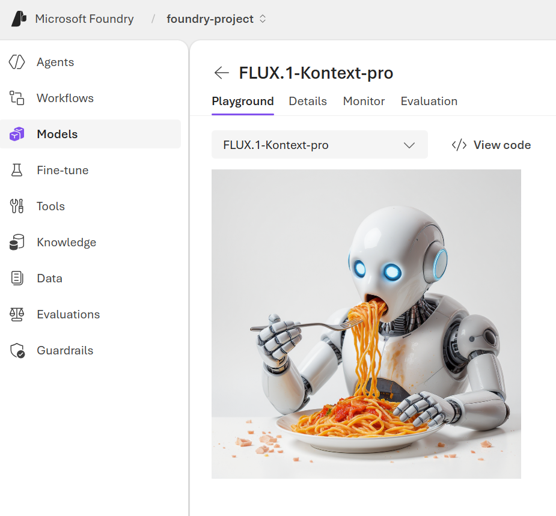

---
lab:
    title: 'Generate images with AI'
    description: 'Use an OpenAI image generation model in Microsoft Foundry to generate images.'
---

# Generate images with AI

In this exercise, you use the OpenAI image generation model to generate images. You also use the OpenAI Python SDK to create a simple app to generate images based on your prompts.

> **Note**: This exercise is based on pre-release SDK software, which may be subject to change. Where necessary, we've used specific versions of packages; which may not reflect the latest available versions. You may experience some unexpected behavior, warnings, or errors.

While this exercise is based on the OpenAI Python SDK, you can develop AI chat applications using multiple language-specific SDKs; including:

* [OpenAI Projects for Microsoft .NET](https://www.nuget.org/packages/OpenAI)
* [OpenAI Projects for JavaScript](https://www.npmjs.com/package/openai)

This exercise takes approximately **30** minutes.

## Create a Foundry project

Let's start by creating a Foundry project.

1. In a web browser, open the [Foundry portal](https://ai.azure.com) at `https://ai.azure.com` and sign in using your Azure credentials.

1. Ensure the **New Foundry** toggle is set to *On*.

    

1. You may be prompted to create a new project before continuing to the New Foundry experience. Select **Create a new project**.

    

    If you're not prompted, select the projects drop down menu on the upper left, and then select **Create new project**.

1. Enter a name for your Foundry project in the textbox and select **Create**.

    Wait a few moments for the project to be created. The new Foundry portal home page should appear with your project selected.

## Choose a model to start a project

A Microsoft Foundry *project* provides a collaborative workspace for AI development. Let's start by choosing a model that we want to work with and creating a project to use it in.
> **Note**: Microsoft Foundry projects can be based on a **Foundry* resource, which provides access to AI models (including Azure OpenAI), Azure AI services, and other resources for developing AI agents and chat solutions. Alternatively, projects can be based on *AI hub* resources; which include connections to Azure resources for secure storage, compute, and specialized tools. Microsoft Foundry based projects are great for developers who want to manage resources for AI agent or chat app development. AI hub based projects are more suitable for enterprise development teams working on complex AI solutions.

1. Select **Build** from the navigation bar.

1. Select **Models** from the left-hand menu, and then select **Deploy a base model**.

1. Enter **Flux** in the search box, and then select the **FLUX.1-Kontext-pro** model from the search results.

1. Select **Deploy** with the default settings to create a deployment of the model.

    After the model is deployed, the playground for the model is displayed.

## Test the model in the playground

Before creating a client application, let's test the Flux model in the playground.

1. Select **Playgrounds**, and then **Images playground**.

1. Ensure your Flux model deployment is selected. Then, in the box near the bottom of the page, enter a prompt such as `Create an image of an robot eating spaghetti` and select **Generate**.

1. Review the resulting image in the playground:

    

1. Enter a follow-up prompt, such as `Show the robot in a restaurant` and review the resulting image.

1. Continue testing with new prompts to refine the image until you are happy with it. 

1. Select the **\</\> View Code** button and ensure you are on the **Entra ID authentication** tab. Then record the following information for use later in the exercise. Note the values are examples, be sure to record the information from your deployment.

    * OpenAI Endpoint: *https://flux-resource.cognitiveservices.azure.com/*
    * Deployment name (model name): *FLUX.1-Kontext-pro*

## Create a client application

Now you can use the OpenAI SDK to generate images in a client application.

### Prepare the application configuration

1. Open **Visual Studio Code** on your local computer. If you don't have it installed, download it from [https://code.visualstudio.com](https://code.visualstudio.com).

1. Open a terminal in VS Code (**Terminal > New Terminal**) and clone the GitHub repo containing the code files for this exercise:

    ```
    git clone https://github.com/microsoftlearning/mslearn-ai-vision mslearn-ai-vision
    ```

1. After the repo has been cloned, open the folder in VS Code (**File > Open Folder**), and navigate to the `mslearn-ai-vision/labfiles/image-client/python` folder.

1. In the VS Code Explorer pane, review the files in the folder:

    - `.env` - A configuration file for application settings.
    - `image-client.py` - The Python code file for the image application.
    - `requirements.txt` - A file listing the package dependencies.

1. Open a terminal in VS Code and navigate to the project folder, then install the required libraries:

    ```
    cd mslearn-ai-vision/labfiles/image-client/python
    python -m venv labenv
    ```

1. Activate the virtual environment:

    ```
    labenv\Scripts\activate
    ```

1. Install the required packages:

    ```
    pip install -r requirements.txt
    ```

1. In VS Code, open the `.env` file.

1. Replace the **your_endpoint** and **your_model_deployment**  placeholders with the values you recorded from the from the **Images playground**.

1. Save the `.env` file.

### Write code to connect to your project and chat with your model

> **Tip**: As you add code, be sure to maintain the correct indentation.

1. In VS Code, open the `image-client.py` file.

1. In the code file, note the existing statements that have been added at the top of the file to import the necessary SDK namespaces. Then, under the comment **Add references**, add the following code to reference the namespaces in the libraries you installed previously:

    ```python
   # Add references
   from dotenv import load_dotenv
   from azure.identity import DefaultAzureCredential, get_bearer_token_provider
   from openai import AzureOpenAI
   import requests
    ```

1. In the **main** function, under the comment **Get configuration settings**, note that the code loads the endpoint and model deployment name values you defined in the configuration file.

1. Under the comment **Initialize the client**, add the following code to connect to your model using the Azure credentials you are currently signed in with:

    ```python
   # Initialize the client
   token_provider = get_bearer_token_provider(
       DefaultAzureCredential(exclude_environment_credential=True,
           exclude_managed_identity_credential=True), 
       "https://cognitiveservices.azure.com/.default"
   )
    
   client = OpenAI(
        base_url=endpoint,
        api_key=token_provider,
    )
    ```

1. Note that the code includes a loop to allow a user to input a prompt until they enter "quit". Then in the loop section, under the comment **Generate an image**, add the following code to submit the prompt and retrieve the URL for the generated image from your model:

    **Python**

    ```python
   # Generate an image
   result = client.images.generate(
        model=model_deployment,
        prompt=input_text,
        n=1
    )

   json_response = json.loads(result.model_dump_json())
   image_url = json_response["data"][0]["url"] 
    ```

1. Note that the code in the remainder of the **main** function passes the image URL and a filename to a provided function, which downloads the generated image and saves it as a .png file.

1. Use the **CTRL+S** command to save your changes to the code file.

### Run the client application

1. In the VS Code terminal, sign into Azure:

    ```
    az login
    ```

    **<font color="red">You must sign into Azure to authenticate with your Azure OpenAI resource.</font>**

    > **Note**: In most scenarios, just using *az login* will be sufficient. However, if you have subscriptions in multiple tenants, you may need to specify the tenant by using the *--tenant* parameter.

1. When prompted, follow the instructions to open the sign-in page in a new tab and enter the authentication code provided and your Azure credentials.

1. After you have signed in, run the application:

    ```
   python image-client.py
    ```

1. When prompted, enter a request for an image, such as `Create an image of a robot eating pizza`. 
    
    After a moment or two, the app should confirm that the image has been saved. The image should appear in the `images` folder in your project directory with the name `image_1.png`.

1. Try a few more prompts. When you're finished, enter `quit` to exit the program.

    > **Note**: In this simple app, we haven't implemented logic to retain conversation history; so the model will treat each prompt as a new request with no context of the previous prompt.

1. Review the generated images in the `images` folder.

## Summary

In this exercise, you used Microsoft Foundry and the Azure OpenAI SDK to create a client application uses a Flux model to generate images.

## Clean up

If you've finished exploring Flux, you should delete the resources you have created in this exercise to avoid incurring unnecessary Azure costs.
1. Return to the browser tab containing the Azure portal (or re-open the [Azure portal](https://portal.azure.com) at `https://portal.azure.com` in a new browser tab) and view the contents of the resource group where you deployed the resources used in this exercise.
1. On the toolbar, select **Delete resource group**.
1. Enter the resource group name and confirm that you want to delete it.
