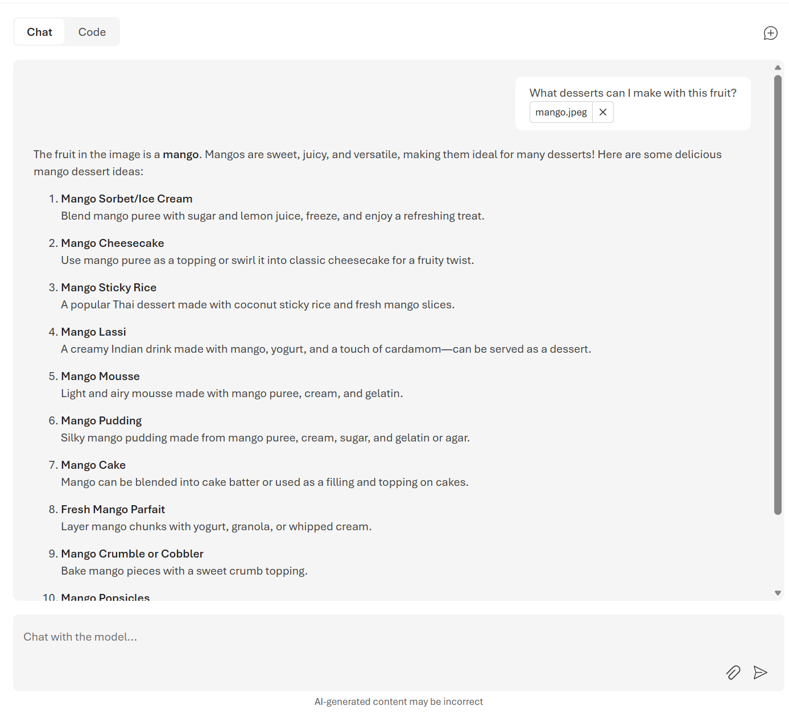
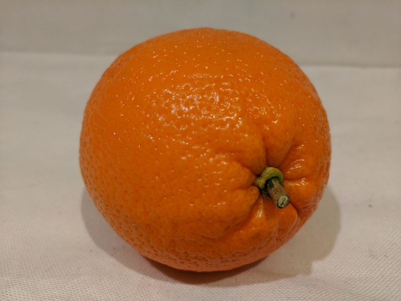

---
lab:
    title: 'Develop a vision-enabled chat app'
    description: 'Use Azure AI Foundry to build a generative AI app that supports image input.'
---

# Develop a vision-enabled chat app

In this exercise, you use the *Phi-4-multimodal-instruct* generative AI model to generate responses to prompts that include images. You'll develop an app that provides AI assistance with fresh produce in a grocery store by using Azure AI Foundry and the Azure AI Model Inference service.

> **Note**: This exercise is based on pre-release SDK software, which may be subject to change. Where necessary, we've used specific versions of packages; which may not reflect the latest available versions. You may experience some unexpected behavior, warnings, or errors.

While this exercise is based on the Azure AI Foundry Python SDK, you can develop AI chat applications using multiple language-specific SDKs; including:

- [Azure AI Projects for Python](https://pypi.org/project/azure-ai-projects)
- [Azure AI Projects for Microsoft .NET](https://www.nuget.org/packages/Azure.AI.Projects)
- [Azure AI Projects for JavaScript](https://www.npmjs.com/package/@azure/ai-projects)

This exercise takes approximately **30** minutes.


## Create a Foundry project

Let's start by creating a Foundry project.

1. In a web browser, open the [Foundry portal](https://ai.azure.com) at `https://ai.azure.com` and sign in using your Azure credentials.

1. Ensure the **New Foundry** toggle is set to *On*.

    

1. You may be prompted to create a new project before continuing to the New Foundry experience. Select **Create a new project**.

    

    If you're not prompted, select the projects drop down menu on the upper left, and then select **Create new project**.

1. Enter a name for your Foundry project in the textbox and select **Create**.

    Wait a few moments for the project to be created. The new Foundry portal home page should appear with your project selected.

## Choose a model to start a project

A Microsoft Foundry *project* provides a collaborative workspace for AI development. Let's start by choosing a model that we want to work with and creating a project to use it in.
> **Note**: Microsoft Foundry projects can be based on a **Foundry* resource, which provides access to AI models (including Azure OpenAI), Azure AI services, and other resources for developing AI agents and chat solutions. Alternatively, projects can be based on *AI hub* resources; which include connections to Azure resources for secure storage, compute, and specialized tools. Microsoft Foundry based projects are great for developers who want to manage resources for AI agent or chat app development. AI hub based projects are more suitable for enterprise development teams working on complex AI solutions.

1. Select **Build** from the navigation bar.

1. Select **Models** from the left-hand menu, and then select **Deploy a base model**.

1. Enter **gpt-4.1** in the search box, and then select the **gpt-4.1** model from the search results.

1. Select **Deploy** with the default settings to create a deployment of the model.

    After the model is deployed, the playground for the model is displayed.

## Test the model in the playground

Now you can test your multimodal model deployment with an image-based prompt in the chat playground.


1. In a new browser tab, download [mango.jpeg](https://github.com/MicrosoftLearning/mslearn-ai-vision/raw/refs/heads/main/Labfiles/gen-ai-vision/mango.jpeg) from `https://github.com/MicrosoftLearning/mslearn-ai-vision/raw/refs/heads/main/Labfiles/gen-ai-vision/mango.jpeg` and save it to a folder on your local file system.

1. Navigate back to the chat playground page for your model deployment in the Foundry portal. 

1. In the main chat session panel, under the chat input box, use the attach button (**&#128206;**) to upload the *mango.jpeg* image file, and then add the text `What desserts could I make with this fruit?` and submit the prompt.

    

1. Review the response, which should hopefully provide relevant guidance for desserts you can make using a mango.

## Create a client application

Now that you've deployed the model, you can use the deployment in a client application.

### Prepare the application configuration


### Prepare the application configuration

1. Open **Visual Studio Code** on your local computer. If you don't have it installed, download it from [https://code.visualstudio.com](https://code.visualstudio.com).

1. Open a terminal in VS Code (**Terminal > New Terminal**) and clone the GitHub repo containing the code files for this exercise:

    ```
    git clone https://github.com/microsoftlearning/mslearn-ai-vision mslearn-ai-vision
    ```

1. After the repo has been cloned, open the folder in VS Code (**File > Open Folder**), and navigate to the `mslearn-ai-vision/labfiles/gen-ai-vision/python` folder.

1. In the VS Code Explorer pane, review the files in the folder:

    - `.env` - A configuration file for application settings.
    - `chat-app.py` - The Python code file for the chat application.
    - `requirements.txt` - A file listing the package dependencies.

1. Open a terminal in VS Code and navigate to the project folder, then install the required libraries:

    ```
    cd mslearn-ai-vision/labfiles/gen-ai-vision/python
    python -m venv labenv
    ```

1. Activate the virtual environment:

    ```
    labenv\Scripts\activate
    ```

1. Install the required packages:

    ```
    pip install -r requirements.txt
    ```

1. In VS Code, open the `.env` file.

1. Replace the **your_endpoint** and **your_model_deployment**  placeholders with the values you recorded from the from the **Images playground**.

1. Save the `.env` file.

### Write code to connect to your project and get a chat client for your model

> **Tip**: As you add code, be sure to maintain the correct indentation.

1. In VS Code, open the `chat-app.py` file.

1. In the code file, note the existing statements that have been added at the top of the file to import the necessary SDK namespaces. Then, Find the comment **Add references**, add the following code to reference the namespaces in the libraries you installed previously:

    ```python
   # Add references
   from openai import OpenAI
   from azure.identity import DefaultAzureCredential, get_bearer_token_provider
    ```

1. In the **main** function, under the comment **Get configuration settings**, note that the code loads the project connection string and model deployment name values you defined in the configuration file.

1. In the **main** function, under the comment **Get configuration settings**, note that the code loads the project connection string and model deployment name values you defined in the configuration file.

1. Find the comment **Initialize the project client**, and add the following code to connect to your Azure AI Foundry project:

    > **Tip**: Be careful to maintain the correct indentation level for your code.

    ```python
   # Initialize the project client
   client = OpenAI(
       base_url=endpoint,
       api_key=token_provider
   )
    ```

### Write code to submit a URL-based image prompt

1. Note that the code includes a loop to allow a user to input a prompt until they enter "quit". Then in the loop section, find the comment **Get a response to image input**, add the following code to submit a prompt that includes the following image:

    

    ```python
   # Get a response to image input
   image_url = "https://github.com/MicrosoftLearning/mslearn-ai-vision/raw/refs/heads/main/Labfiles/gen-ai-vision/orange.jpeg"
   image_format = "jpeg"
   request = Request(image_url, headers={"User-Agent": "Mozilla/5.0"})
   image_data = base64.b64encode(urlopen(request).read()).decode("utf-8")
   data_url = f"data:image/{image_format};base64,{image_data}"

   response = client.chat.completions.create(
        model=model_deployment,
        messages=[
            {"role": "system", "content": system_message},
            { "role": "user", "content": [  
                { "type": "text", "text": prompt},
                { "type": "image_url", "image_url": {"url": data_url}}
            ] } 
        ]
   )
   print(response.choices[0].message.content)
    ```

1. Use the **CTRL+S** command to save your changes to the code file - don't close it yet though.

## Sign into Azure and run the app

1. In the VS Code terminal, sign into Azure:

    ```
    az login
    ```

    **<font color="red">You must sign into Azure to authenticate with your Azure OpenAI resource.</font>**

    > **Note**: In most scenarios, just using *az login* will be sufficient. However, if you have subscriptions in multiple tenants, you may need to specify the tenant by using the *--tenant* parameter.

1. When prompted, follow the instructions to open the sign-in page in a new tab and enter the authentication code provided and your Azure credentials.

1. After you have signed in, run the application:

    ```
   python chat-app.py
    ```

1. When prompted, enter the following prompt:

    ```
   Suggest some recipes that include this fruit
    ```

1. Review the response. Then enter `quit` to exit the program.

### Modify the code to upload a local image file

1. In the code editor for your app code, in the loop section, find the code you added previously under the comment **Get a response to image input**. Then modify the code as follows, to upload this local image file:

    

    ```python
   # Get a response to image input
   script_dir = Path(__file__).parent  # Get the directory of the script
   image_path = script_dir / 'mystery-fruit.jpeg'
   mime_type = "image/jpeg"

   # Read and encode the image file
   with open(image_path, "rb") as image_file:
        base64_encoded_data = base64.b64encode(image_file.read()).decode('utf-8')

   # Include the image file data in the prompt
   data_url = f"data:{mime_type};base64,{base64_encoded_data}"
   response = client.chat.completions.create(
            model=model_deployment,
            messages=[
                {"role": "system", "content": system_message},
                { "role": "user", "content": [  
                    { "type": "text", "text": prompt},
                    { "type": "image_url", "image_url": {"url": data_url}}
                ] } 
            ]
   )
   print(response.choices[0].message.content)
    ```

1. Use the **CTRL+S** command to save your changes to the code file. You can also close the code editor (**CTRL+Q**) if you like.

1. In the cloud shell command line pane beneath the code editor, enter the following command to run the app:

    ```
   python chat-app.py
    ```

1. When prompted, enter the following prompt:

    ```
   What is this fruit? What recipes could I use it in?
    ```

15. Review the response. Then enter `quit` to exit the program.

    > **Note**: In this simple app, we haven't implemented logic to retain conversation history; so the model will treat each prompt as a new request with no context of the previous prompt.

## Clean up

If you've finished exploring Azure AI Foundry portal, you should delete the resources you have created in this exercise to avoid incurring unnecessary Azure costs.

1. Open the [Azure portal](https://portal.azure.com) and view the contents of the resource group where you deployed the resources used in this exercise.
1. On the toolbar, select **Delete resource group**.
1. Enter the resource group name and confirm that you want to delete it.
