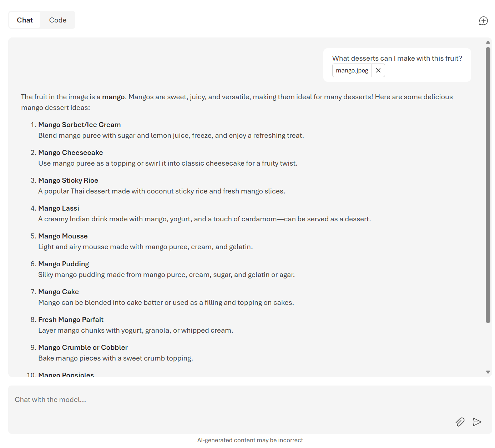

---
lab:
    title: 'Getting started: set up your environment'
    description: 'Shared setup for the Analyze visual content with AI lab: create a Microsoft Foundry project, deploy a multimodal model, get the starter code, and configure your environment. Complete this once before any task.'
    level: 300
    concepts: 'environment setup, Microsoft Foundry project, model deployment'
    status: 'draft'
---

# Getting started

This page sets up everything the **Analyze visual content with AI** lab needs. **Every task begins
here** — complete this page first. Each task is written so you can then do it on its own; if you're
working through the whole lab in one sitting, you only need to do this setup once.

**Your scenario:** you work at **Wide World Importers**, a specialty grocery importer that ships
unusual produce to supermarkets worldwide, and runs its own marketing studio. Across the lab you'll
build the AI that helps store staff identify unfamiliar produce and helps the studio tag its image
library.

> **Note**: Some of the technologies used in this lab are in preview or in active
> development. You may experience some unexpected behavior, warnings, or errors.

## Prerequisites

Before starting, ensure you have:

- An active [Azure subscription](https://azure.microsoft.com/pricing/purchase-options/azure-account) with sufficient permissions and quota to provision Azure AI resources
- [Visual Studio Code](https://code.visualstudio.com/) installed on your local machine
- [Python 3.13](https://www.python.org/downloads/) or later installed\*
- [Git](https://git-scm.com/downloads) installed and configured
- [Azure CLI](https://learn.microsoft.com/cli/azure/install-azure-cli) installed
- Basic familiarity with Python

> \* Python 3.14 is available, but some dependencies are not yet compiled for that release. The lab has been successfully tested with Python 3.13.12.

## Create a Microsoft Foundry project

Microsoft Foundry uses projects to organize models, resources, data, and other assets used to
develop an AI solution.

1. In a web browser, open the [Foundry portal](https://ai.azure.com) at `https://ai.azure.com` and sign in using your Azure credentials. Close any tips or quick start panes that are opened the first time you sign in.

    > **Important**: For this lab, you're using the **New** Foundry experience. If it isn't already enabled, enable the **New Foundry** option in the toolbar at the top of the page.

1. When prompted, create a **new** project with a unique name. Expand the **Advanced options** area and specify:
    - **Foundry resource**: *Use the default name for your resource (usually {project_name}-resource)*
    - **Subscription**: *Your Azure subscription*
    - **Resource group**: *Create or select a resource group*
    - **Region**: *Select any available region*\*

    > \* Some Azure AI resources are constrained by regional model quotas. If you hit a quota limit later, you may need to create another resource in a different region.

1. Select **Create** and wait for your project to be created.

1. On the home page for your project, note that the API key, project endpoint, and **Azure OpenAI endpoint** are displayed.

    > **Important**: You need the **Azure OpenAI endpoint**, <u>not</u> the project endpoint. Copy it now — you'll add it to your `.env` in a moment.

## Deploy a model

Tasks 1 and 2 need a model that can process image-based input.

1. On the **Discover** page, select the **Models** tab to view the Microsoft Foundry model catalog.

1. Search for and deploy the `gpt-5.2` model using the default settings. Deployment may take a minute or so.

    > **Tip**: Model deployments are subject to regional quotas. If you don't have enough quota to deploy `gpt-5.2` in your project's region, use another generally available multimodal model such as `gpt-4.1` or `gpt-4o`. Alternatively, create a new project in a different region.

1. When the model has been deployed, the model playground page opens, where you can chat with the model.

    > **Tip**: Note the model deployment name (which by default matches the model name, for example *gpt-5.2*) — you'll need it for `MODEL_DEPLOYMENT_NAME`.

## Test the model in the playground

Before you write any code, confirm your deployment can actually read an image.

1. In a new browser tab, download [mango.jpeg](https://microsoftlearning.github.io/mslearn-ai-vision/Labfiles/A-analyze-visual-content-with-ai/mango.jpeg) from `https://microsoftlearning.github.io/mslearn-ai-vision/Labfiles/A-analyze-visual-content-with-ai/mango.jpeg` and save it to a folder on your local file system.

1. Navigate back to the chat playground page for your model deployment in the Foundry portal.

1. In the main chat session panel, under the chat input box, use the attach button (**&#128206;**) to upload the *mango.jpeg* image file, and then add the text `What desserts could I make with this fruit?` and submit the prompt.

    

1. Review the response, which should provide relevant guidance for desserts you can make using a mango.

## Get the starter code

1. In VS Code, open the Command Palette (**Ctrl+Shift+P**), run **Git: Clone**, and enter:

    ```
    https://github.com/microsoftlearning/mslearn-ai-vision.git
    ```

    You may be prompted to confirm you trust the authors.

1. Open the cloned repo, then **File > Open Folder** and select `mslearn-ai-vision/Labfiles/A-analyze-visual-content-with-ai/Python`. This single folder holds the starter code for **every** task in this lab — you use one virtual environment and one `.env` throughout.

1. In VS Code, view the **Extensions** pane and, if it isn't already installed, install the **Python** extension.

1. Right-click **requirements.txt** and choose **Open in Integrated Terminal**. Then create a virtual environment and install packages:

    ```
    python -m venv labenv
    .\labenv\Scripts\Activate.ps1
    pip install -r requirements.txt
    ```

1. Copy **.env.example** to a new file named **.env**, then open it and set the values you have so far:

    - `OPENAI_ENDPOINT` — the Azure OpenAI endpoint for your Foundry resource, ending in `/openai/v1/`, so it looks like `https://{your-resource-name}.openai.azure.com/openai/v1/`
    - `MODEL_DEPLOYMENT_NAME` — the deployment name of the model you deployed above

    Save the file.

    > `CONTENT_UNDERSTANDING_ENDPOINT` and `ANALYZER_ID` are only used by **Task 3**, which walks you through creating the analyzer they refer to. Leave them as they are for now.

## Sign in to Azure

Every task in this lab authenticates with `DefaultAzureCredential`, which uses your Azure CLI
sign-in. In the terminal, run:

```
az login
```

> **Note**: In most scenarios, just using *az login* will be sufficient. However, if you have subscriptions in multiple tenants, you may need to specify the tenant by using the *--tenant* parameter. See [Sign into Azure interactively using the Azure CLI](https://learn.microsoft.com/cli/azure/authenticate-azure-cli-interactively) for details.

## Check you're ready for a task

Each task needs specific values in your `.env`. Before starting a task, run the preflight
check from the `Python` folder — it reads your `.env` and tells
you what (if anything) is missing:

```
python ../setup/check_env.py --task 1
```

Swap `1` for the task number you're about to start. That's it — head to any task:

| Task | Page |
| --- | --- |
| Task 1 – Ask a model about an image | [A1](A1-ask-a-model-about-an-image.md) |
| Task 2 – Send a local image file | [A2](A2-send-a-local-image-file.md) |
| Task 3 – Extract structured metadata with Content Understanding | [A3](A3-extract-structured-metadata.md) |
