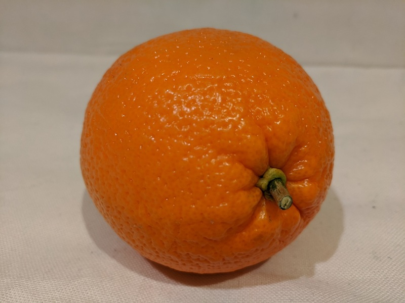

---
lab:
    title: 'Task 1 – Ask a model about an image'
    description: 'Use the Responses API to send an image and a question to a multimodal model in Microsoft Foundry, and build a Wide World Importers produce assistant around it.'
    level: 300
    concepts: 'multimodal chat, image input, Responses API'
    islab: true
    status: 'draft'
---

# Task 1 — Ask a model about an image

*Part of the **Analyze visual content with AI** lab. New here? Start with [Getting started](A0-getting-started.md).*

> **Set up (start here):** This task needs a Foundry project with a multimodal model deployed, and
> the starter code. If you haven't already, complete [Getting started](A0-getting-started.md) to
> create your project, deploy the model, clone the code, and set `OPENAI_ENDPOINT` and
> `MODEL_DEPLOYMENT_NAME` in `Python/.env`. Then, from the
> `Labfiles/A-analyze-visual-content-with-ai` folder, verify you're ready:

```
python ../setup/check_env.py --task 1
```

> **Continuing from a previous task?** If you just finished an earlier task in the same
> `Python` folder, your project, virtual environment, and `.env` are already set — go
> straight to **Write code to get an OpenAI chat client** below.

---

A crate arrives at a Wide World Importers store and nobody on the floor recognizes what's in it.
The staff member doesn't want a label — they want an answer: what is it, is it ripe, what do
customers do with it? In this task you'll build the **produce assistant** that answers exactly
that, by sending a photograph and a question to a multimodal model in the same request.

<style>
/* "Ask Mika" just-in-time concept blocks */
details.concept { margin:.6rem 0 1rem; }
details.concept > summary { display:inline-block; cursor:pointer; list-style:none;
  font-size:.85em; font-weight:600; color:#6b4ba1; background:#6b4ba112;
  border:1px solid #6b4ba133; border-radius:999px; padding:.2em .7em; }
details.concept > summary::-webkit-details-marker { display:none; }
details.concept > summary::before { content:"Ask Mika: "; font-weight:700; }
details.concept > summary:hover { background:#6b4ba1; color:#fff; border-color:#6b4ba1; }
details.concept[open] > summary { border-bottom-left-radius:0; border-bottom-right-radius:0; }
details.concept .concept-body { border:1px solid #6b4ba133; border-top:none;
  border-radius:0 8px 8px 8px; padding:.6rem .9rem; background:#6b4ba108; font-size:.95em; }
</style>

<details markdown="1" class="concept">
<summary>What is the Responses API?</summary>
<div class="concept-body" markdown="1">

The **Responses API** is the current API for generating model output on Microsoft Foundry. Instead
of a flat list of chat messages, you pass an `input` array where a single message's `content` can
mix **parts** — an `input_text` part for your question and an `input_image` part for the picture.
The model sees both together, so it can answer questions *about* the image rather than about a
description of it.

The `image_url` part accepts a public URL (this task) or a base64 data URL for a local file
(Task 2).

[Learn more →](https://learn.microsoft.com/azure/foundry/openai/how-to/responses)

</div>
</details>

Open the `Python` folder and activate the virtual environment from [Getting started](A0-getting-started.md) (`.\labenv\Scripts\Activate.ps1`), then continue below.

### Write code to get an OpenAI chat client

Open **image_chat_url.py** and add code at each commented placeholder.

1. Review the code already in the file. It contains:
    - Some **import** statements.
    - A `main` function that loads your configuration, defines a system message, and then loops asking you for a prompt until you type `quit`.

    > **Tip**: As you add code, keep the indentation aligned with the comments.

1. At the top of the file, find the comment **Add references** and add the namespaces you'll need:

    ```python
    # Add references
    from openai import OpenAI
    from azure.identity import DefaultAzureCredential, get_bearer_token_provider
    ```

1. In the **main** function, under the comment **Get configuration settings**, note that the code loads the Azure OpenAI endpoint and model deployment name values you defined in your `.env` file.

1. Find the comment **Create an OpenAI client**, and add the following code to connect to your Foundry resource:

    > **Tip**: Be careful to maintain the correct indentation level for your code.

    ```python
    # Create an OpenAI client
    credential = DefaultAzureCredential()
    token_provider = get_bearer_token_provider(credential, "https://ai.azure.com/.default")
    client = OpenAI(
        base_url=openai_endpoint,
        api_key=token_provider()
    )
    ```

    The **DefaultAzureCredential** object authenticates using your `az login` session. The token
    provider exchanges that sign-in for a bearer token scoped to Azure AI, which the **OpenAI**
    client sends with every request — so there's no API key in your code.

### Write code to submit a URL-based image prompt

1. Note that the code includes a loop to allow a user to input a prompt until they enter "quit". In the loop section, find the comment **Get a response to image input** and add the following code to submit a prompt that includes this image:

    

    ```python
    # Get a response to image input
    image_url = "https://microsoftlearning.github.io/mslearn-ai-vision/Labfiles/A-analyze-visual-content-with-ai/orange.jpeg"
    response = client.responses.create(
        model=model_deployment,
        input=[
            {"role": "developer", "content": system_message},
            {"role": "user", "content": [
                {"type": "input_text", "text": prompt},
                {"type": "input_image", "image_url": image_url}
            ]}
        ]
    )
    print(response.output_text)
    ```

    The `developer` message carries the standing instructions for the assistant. The `user` message
    carries **two parts** — the question as `input_text` and the picture as `input_image` — which is
    what lets the model reason about both at once.

1. Save the file (**Ctrl+S**).

### Run and test

1. In the terminal, make sure you're signed in and then run the app:

    ```
    az login
    ```

    ```
    python image_chat_url.py
    ```

    `az login` lets `DefaultAzureCredential` authenticate to your Azure account.

1. When prompted, enter the following prompt:

    ```
    Suggest some recipes that include this fruit
    ```

1. Review the response — it should suggest recipes built around an orange, which the model has read
    directly from the picture. Then enter `quit` to exit the program.

    > **Tip**: If the app fails because the rate limit is exceeded, wait a few seconds and try again. If there is insufficient quota available in your subscription, the model may not be able to respond.

    > **Note**: In this simple app, we haven't implemented logic to retain conversation history; so the model will treat each prompt as a new request with no context of the previous prompt.

> ✅ **Checkpoint**: You've sent an image and a question to a multimodal model in a single request
> and got a grounded answer back. That's the Core of this lab. The optional tasks below extend it
> to local files and to structured, searchable metadata.

When you're finished, enter `deactivate` to exit the virtual environment.

---

**Next (optional):** [Task 2 — Send a local image file](A2-send-a-local-image-file.md) · [Task 3 — Extract structured metadata with Content Understanding](A3-extract-structured-metadata.md)
