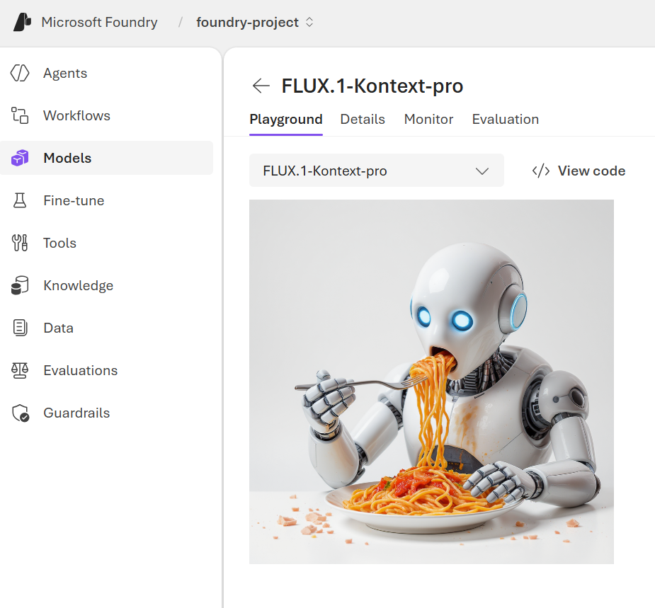

---
lab:
    title: 'Getting started: set up your environment'
    description: 'Shared setup for the Generate images and video with AI lab: create a Microsoft Foundry project, deploy image and video generation models, get the starter code, and configure your environment. Complete this once before any task.'
    level: 300
    concepts: 'environment setup, Microsoft Foundry project, model deployment'
    status: 'draft'
---

# Getting started

This page sets up everything the **Generate images and video with AI** lab needs. **Every task
begins here** — complete this page first. Each task is written so you can then do it on its own; if
you're working through the whole lab in one sitting, you only need to do this setup once.

**Your scenario:** you work at **Wide World Importers**, a specialty grocery importer that ships
unusual produce to supermarkets worldwide, and runs its own marketing studio. Across the lab you'll
build the studio's generation pipeline, from campaign artwork to short promo clips.

> **Note**: Some of the technologies used in this lab are in preview or in active
> development. You may experience some unexpected behavior, warnings, or errors.

## Prerequisites

Before starting, ensure you have:

- An active [Azure subscription](https://azure.microsoft.com/pricing/purchase-options/azure-account) with sufficient permissions and quota to provision Azure AI resources
- [Visual Studio Code](https://code.visualstudio.com/) installed on your local machine
- [Python 3.13](https://www.python.org/downloads/) or later installed\*
- [Git](https://git-scm.com/downloads) installed and configured
- [Azure CLI](https://learn.microsoft.com/cli/azure/install-azure-cli) installed
- Basic familiarity with Python

> \* Python 3.14 is available, but some dependencies are not yet compiled for that release. The lab has been successfully tested with Python 3.13.12.

## Create a Microsoft Foundry project

Microsoft Foundry uses projects to organize models, resources, data, and other assets used to
develop an AI solution.

1. In a web browser, open the [Foundry portal](https://ai.azure.com) at `https://ai.azure.com` and sign in using your Azure credentials. Close any tips or quick start panes that are opened the first time you sign in.

    > **Important**: For this lab, you're using the **New** Foundry experience. If it isn't already enabled, enable the **New Foundry** option in the toolbar at the top of the page.

1. When prompted, create a **new** project with a unique name. Expand the **Advanced options** area and specify:
    - **Foundry resource**: *Use the default name for your resource (usually {project_name}-resource)*
    - **Subscription**: *Your Azure subscription*
    - **Resource group**: *Create or select a resource group*
    - **Region**: *Select any available region*\*

    > \* Some Azure AI resources are constrained by regional model quotas. If you hit a quota limit later, you may need to create another resource in a different region.

1. Select **Create** and wait for your project to be created.

1. On the home page for your project, note that the API key, project endpoint, and **Azure OpenAI endpoint** are displayed.

    > **Important**: You need the **Azure OpenAI endpoint**, <u>not</u> the project endpoint. Copy it now — you'll add it to your `.env` in a moment.

## Deploy the models

Deploy the model for the task you plan to do. If you're working through the whole lab, deploy both.

### Image generation model (Task 1)

1. On the **Discover** page, select the **Models** tab to view the Microsoft Foundry model catalog.

1. Search for and deploy the `gpt-image-2` model using the default settings. Deployment may take a minute or so.

    After the model is deployed, the playground for the model is displayed.

    > **Tip**: Note the model deployment name (which by default should be *gpt-image-2*) — you'll need it for `IMAGE_MODEL_DEPLOYMENT_NAME`.

### Video generation model (Tasks 2 and 3)

1. Back on the **Models** tab of the **Discover** page, search for and deploy the `sora-2` model using the default settings.

    > **Note**: Access to video generation models is restricted — you may need to register your subscription before **sora-2** is available to deploy. If you can't deploy it, you can still complete Task 1 in full.

1. When the model has been deployed, the model playground page opens.

    > **Tip**: Note the model deployment name (which by default should be *sora-2*) — you'll need it for `VIDEO_MODEL_DEPLOYMENT_NAME`.

## Test the models in the playground

Before you write any code, get a feel for what each model does.

### Try image generation

1. In the playground for your `gpt-image-2` deployment, in the box near the bottom of the page, select the smallest available size and enter a prompt such as `A crate of fresh citrus fruit on a sunlit market stall`.

1. Review the resulting image in the playground:

    

1. Enter a follow-up prompt, such as `Show the crate in a busy street market` and review the resulting image.

1. Continue testing with new prompts to refine the image until you're happy with it.

### Try video generation

1. In the playground for your `sora-2` deployment, enter the following prompt into the text box:

    ```
    A slow pan across a market stall stacked with colorful imported fruit.
    ```

1. Set the video duration to 4 seconds.

1. Select **Generate** to start the video generation process.

    > **Note**: Video generation typically takes 1 to 5 minutes depending on your settings. The content generation APIs include content moderation filters. If the service recognizes your prompt as harmful content, it won't return a generated video.

1. When the AI-generated video is ready, it appears on the page. Review the generated video.

1. In the video details pane text box, edit the video by submitting the following instructions:

    ```
    Use an inviting instrumental as the background music.
    ```

## Get the starter code

1. In VS Code, open the Command Palette (**Ctrl+Shift+P**), run **Git: Clone**, and enter:

    ```
    https://github.com/microsoftlearning/mslearn-ai-vision.git
    ```

    You may be prompted to confirm you trust the authors.

1. Open the cloned repo, then **File > Open Folder** and select `mslearn-ai-vision/Labfiles/B-generate-images-and-video-with-ai/Python`. This single folder holds the starter code for **every** task in this lab — you use one virtual environment and one `.env` throughout.

1. In VS Code, view the **Extensions** pane and, if it isn't already installed, install the **Python** extension.

1. Right-click **requirements.txt** and choose **Open in Integrated Terminal**. Then create a virtual environment and install packages:

    ```
    python -m venv labenv
    .\labenv\Scripts\Activate.ps1
    pip install -r requirements.txt
    ```

    > **Important**: Tasks 2 and 3 use `client.videos`, which needs a recent version of the OpenAI library. If you see `AttributeError: 'OpenAI' object has no attribute 'videos'`, run `pip install openai --upgrade`.

1. Copy **.env.example** to a new file named **.env**, then open it and set:

    - `OPENAI_ENDPOINT` — the Azure OpenAI endpoint for your Foundry resource, ending in `/openai/v1/`, so it looks like `https://{your-resource-name}.openai.azure.com/openai/v1/`
    - `IMAGE_MODEL_DEPLOYMENT_NAME` — the deployment name of your image generation model (Task 1)
    - `VIDEO_MODEL_DEPLOYMENT_NAME` — the deployment name of your video generation model (Tasks 2 and 3)

    Save the file. You only need to fill in the deployment names for the tasks you plan to do.

## Sign in to Azure

Every task in this lab authenticates with `DefaultAzureCredential`, which uses your Azure CLI
sign-in. In the terminal, run:

```
az login
```

> **Note**: In most scenarios, just using *az login* will be sufficient. However, if you have subscriptions in multiple tenants, you may need to specify the tenant by using the *--tenant* parameter. See [Sign into Azure interactively using the Azure CLI](https://learn.microsoft.com/cli/azure/authenticate-azure-cli-interactively) for details.

## Check you're ready for a task

Each task needs specific values in your `.env`. Before starting a task, run the preflight
check from the `Python` folder — it reads your `.env` and
tells you what (if anything) is missing:

```
python ../setup/check_env.py --task 1
```

Swap `1` for the task number you're about to start. That's it — head to any task:

| Task | Page |
| --- | --- |
| Task 1 – Generate images from a prompt | [B1](B1-generate-images-from-a-prompt.md) |
| Task 2 – Generate video from a text prompt | [B2](B2-generate-video-from-a-prompt.md) |
| Task 3 – Animate a reference image and remix it | [B3](B3-animate-a-reference-image.md) |
