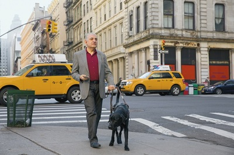
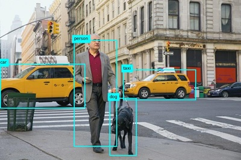
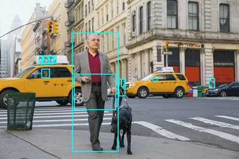

---
lab:
    title: 'Analyze images'
    description: 'Use Azure AI Vision Image Analysis to analyze images, suggest captions and tags, and detect objects and people.'
---

# Analyze images

Azure AI Vision is an artificial intelligence capability that enables software systems to interpret visual input by analyzing images. In Microsoft Azure, the **Vision** Azure AI service provides pre-built models for common computer vision tasks, including analysis of images to suggest captions and tags, detection of common objects and people. You can also use the Azure AI Vision service to remove the background or create a foreground matting of images.

> **Note**: This exercise is based on pre-release SDK software, which may be subject to change. Where necessary, we've used specific versions of packages; which may not reflect the latest available versions. You may experience some unexpected behavior, warnings, or errors.

While this exercise is based on the Azure Vision Python SDK, you can develop vision applications using multiple language-specific SDKs; including:

* [Azure AI Vision Analysis for JavaScript](https://www.npmjs.com/package/@azure-rest/ai-vision-image-analysis)
* [Azure AI Vision Analysis for Microsoft .NET](https://www.nuget.org/packages/Azure.AI.Vision.ImageAnalysis)
* [Azure AI Vision Analysis for Java](https://mvnrepository.com/artifact/com.azure/azure-ai-vision-imageanalysis)

This exercise takes approximately **30** minutes.

## Provision an Azure AI Vision resource

If you don't already have one in your subscription, you'll need to provision an Azure AI Vision resource.

> **Note**: In this exercise, you'll use a standalone **Computer Vision** resource. You can also use Azure AI Vision services in an *Azure AI Services* multi-service resource, either directly or in an *Azure AI Foundry* project.

1. Open the [Azure portal](https://portal.azure.com) at `https://portal.azure.com`, and sign in using your Azure credentials. Close any welcome messages or tips that are displayed.
1. Select **Create a resource**.
1. In the search bar, search for `Computer Vision`, select **Computer Vision**, and create the resource with the following settings:
    - **Subscription**: *Your Azure subscription*
    - **Resource group**: *Create or select a resource group*
    - **Region**: *Choose from **East US**, **West US**, **France Central**, **Korea Central**, **North Europe**, **Southeast Asia**, **West Europe**, or **East Asia**\**
    - **Name**: *A valid name for your Computer Vision resource*
    - **Pricing tier**: Free F0

    \*Azure AI Vision 4.0 full feature sets are currently only available in these regions.

1. Select the required checkboxes and create the resource.
1. Wait for deployment to complete, and then view the deployment details.
1. When the resource has been deployed, go to it and under the **Resource management** node in the navigation pane, view its **Keys and Endpoint** page. You will need the endpoint and one of the keys from this page in the next procedure.

## Develop an image analysis app with the Azure AI Vision SDK

In this exercise, you'll complete a partially implemented client application that uses the Azure AI Vision SDK to analyze images.

### Prepare the application configuration

1. In the Azure portal, use the **[\>_]** button to the right of the search bar at the top of the page to create a new Cloud Shell in the Azure portal, selecting a ***PowerShell*** environment with no storage in your subscription.

    The cloud shell provides a command-line interface in a pane at the bottom of the Azure portal.

    > **Note**: If you have previously created a cloud shell that uses a *Bash* environment, switch it to ***PowerShell***.

    > **Note**: If the portal asks you to select a storage to persist your files, choose **No storage account required**, select the subscription you are using and press **Apply**.

1. In the cloud shell toolbar, in the **Settings** menu, select **Go to Classic version** (this is required to use the code editor).

    **<font color="red">Ensure you've switched to the classic version of the cloud shell before continuing.</font>**

1. Resize the cloud shell pane so you can still see the **Keys and Endpoint** page for your Computer Vision resource.

    > **Tip**" You can resize the pane by dragging the top border. You can also use the minimize and maximize buttons to switch between the cloud shell and the main portal interface.

1. In the cloud shell pane, enter the following commands to clone the GitHub repo containing the code files for this exercise (type the command, or copy it to the clipboard and then right-click in the command line and paste as plain text):

    ```
    rm -r mslearn-ai-vision -f
    git clone https://github.com/MicrosoftLearning/mslearn-ai-vision
    ```

    > **Tip**: As you paste commands into the cloudshell, the output may take up a large amount of the screen buffer. You can clear the screen by entering the `cls` command to make it easier to focus on each task.

1. After the repo has been cloned, use the following command to navigate to and view the folder containing the application code files:   

    ```
   cd mslearn-ai-vision/Labfiles/analyze-images/python/image-analysis
   ls -a -l
    ```

    The folder contains application configuration and code files for your app. It also contains a **/images** subfolder, which contains some image files for your app to analyze.
    
1. Install the Azure AI Vision SDK package and other required packages by running the following commands:

    ```
   python -m venv labenv
   ./labenv/bin/Activate.ps1
   pip install -r requirements.txt azure-ai-vision-imageanalysis==1.0.0
    ```

1. Enter the following command to edit the configuration file for your app:

    ```
   code .env
    ```

    The file is opened in a code editor.

1. In the code file, update the configuration values it contains to reflect the **endpoint** and an authentication **key** for your Computer Vision resource (copied from its **Keys and Endpoint** page in the Azure portal).
1. After you've replaced the placeholders, use the **CTRL+S** command to save your changes and then use the **CTRL+Q** command to close the code editor while keeping the cloud shell command line open.

### Add code to suggest a caption

1. In the cloud shell command line, enter the following command to open the code file for the client application:

    ```
   code image-analysis.py
    ```

    > **Tip**: You might want to maximize the cloud shell pane and move the split-bar between the command line cosole and the code editor so you can see the code more easily.

1. In the code file, find the comment **Import namespaces**, and add the following code to import the namespaces you will need to use the Azure AI Vision SDK:

    ```python
   # import namespaces
   from azure.ai.vision.imageanalysis import ImageAnalysisClient
   from azure.ai.vision.imageanalysis.models import VisualFeatures
   from azure.core.credentials import AzureKeyCredential
    ```

1. In the **Main** function, note that the code to load the configuration settings and determine the image file to be analyzed has been provided. Then find the comment **Authenticate Azure AI Vision client** and add the following code to create and authenticate a Azure AI Vision client object (be sure to maintain the correct indentation levels):

    ```python
   # Authenticate Azure AI Vision client
   cv_client = ImageAnalysisClient(
        endpoint=ai_endpoint,
        credential=AzureKeyCredential(ai_key))
    ```

1. In the **Main** function, under the code you just added, find the comment **Analyze image** and add the following code:

    ```python
   # Analyze image
   with open(image_file, "rb") as f:
        image_data = f.read()
   print(f'\nAnalyzing {image_file}\n')

   result = cv_client.analyze(
        image_data=image_data,
        visual_features=[
            VisualFeatures.CAPTION,
            VisualFeatures.DENSE_CAPTIONS,
            VisualFeatures.TAGS,
            VisualFeatures.OBJECTS,
            VisualFeatures.PEOPLE],
   )
    ```

1. Find the comment **Get image captions**, add the following code to display image captions and dense captions:

    ```python
   # Get image captions
   if result.caption is not None:
        print("\nCaption:")
        print(" Caption: '{}' (confidence: {:.2f}%)".format(result.caption.text, result.caption.confidence * 100))
    
   if result.dense_captions is not None:
        print("\nDense Captions:")
        for caption in result.dense_captions.list:
            print(" Caption: '{}' (confidence: {:.2f}%)".format(caption.text, caption.confidence * 100))
    ```

1. Save your changes (*CTRL+S*) and resize the panes so you can clearly see the command line console while keeping the code editor open. Then enter the following command to run the program with the argument **images/street.jpg**:

    ```
   python image-analysis.py images/street.jpg
    ```

1. Observe the output, which should include a suggested caption for the **street.jpg** image, which looks like this:

    

1. Run the program again, this time with the argument **images/building.jpg** to see the caption that gets generated for the **building.jpg** image, which looks like this:

    

1. Repeat the previous step to generate a caption for the **images/person.jpg** file, which looks like this:

    

### Add code to generate suggested tags

It can sometimes be useful to identify relevant *tags* that provide clues about the contents of an image.

1. In the code editor, in the **AnalyzeImage** function, find the comment **Get image tags** and add the following code:

    ```python
   # Get image tags
   if result.tags is not None:
        print("\nTags:")
        for tag in result.tags.list:
            print(" Tag: '{}' (confidence: {:.2f}%)".format(tag.name, tag.confidence * 100))
    ```

1. Save your changes (*CTRL+S*) and run the program with the argument **images/street.jpg**, observing that in addition to the image caption, a list of suggested tags is displayed.
1. Rerun the program for the **images/building.jpg** and **images/person.jpg** files.

### Add code to detect and locate objects

1. In the code editor, in the **AnalyzeImage** function, find the comment **Get objects in the image** and add the following code to list the objects detected in the image, and call the provided function to annotate an image with the detected objects:

    ```python
   # Get objects in the image
   if result.objects is not None:
        print("\nObjects in image:")
        for detected_object in result.objects.list:
            # Print object tag and confidence
            print(" {} (confidence: {:.2f}%)".format(detected_object.tags[0].name, detected_object.tags[0].confidence * 100))
        # Annotate objects in the image
        show_objects(image_file, result.objects.list)
    ```

1. Save your changes (*CTRL+S*) and run the program with the argument **images/street.jpg**, observing that in addition to the image caption and suggested tags; a file named **objects.jpg** is generated.
1. Use the (Azure cloud shell-specific) **download** command to download the **objects.jpg** file:

    ```
   download objects.jpg
    ```

    The download command creates a popup link at the bottom right of your browser, which you can select to download and open the file. The image should look similar to this:

    

1. Rerun the program for the **images/building.jpg** and **images/person.jpg** files, downloading the generated objects.jpg file after each run.

### Add code to detect and locate people

1. In the code editor, in the **AnalyzeImage** function, find the comment **Get people in the image** and add the following code to list any detected people with a confidence level of 20% or more, and call a provided function to annotate them in an image:

    ```Python
   # Get people in the image
   if result.people is not None:
        print("\nPeople in image:")

        for detected_person in result.people.list:
            if detected_person.confidence > 0.2:
                # Print location and confidence of each person detected
                print(" {} (confidence: {:.2f}%)".format(detected_person.bounding_box, detected_person.confidence * 100))
        # Annotate people in the image
        show_people(image_file, result.people.list)
    ```

1. Save your changes (*CTRL+S*) and run the program with the argument **images/street.jpg**, observing that in addition to the image caption, suggested tags, and objects.jpg file; a list of person locations and file named **people.jpg** is generated.

1. Use the (Azure cloud shell-specific) **download** command to download the **objects.jpg** file:

    ```
   download people.jpg
    ```

    The download command creates a popup link at the bottom right of your browser, which you can select to download and open the file. The image should look similar to this:

    

1. Rerun the program for the **images/building.jpg** and **images/person.jpg** files, downloading the generated people.jpg file after each run.

   > **Tip:** If you see bounding boxes returned from the model that don't make sense, check the JSON confidence score and try increasing the confidence score filtering in your app.

## Clean up resources

If you've finished exploring Azure AI Vision, you should delete the resources you have created in this exercise to avoid incurring unnecessary Azure costs:

1. Open the Azure portal at `https://portal.azure.com`, and sign in using the Microsoft account associated with your Azure subscription.

1. In the top search bar, search for *Computer Vision*, and select the Computer Vision resource you created in this lab.

1. On the resource page, select **Delete** and follow the instructions to delete the resource.

