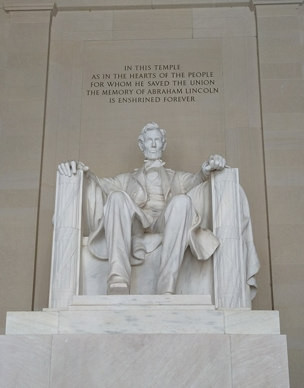
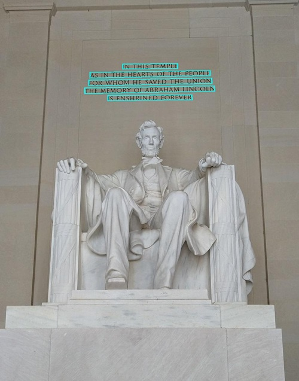
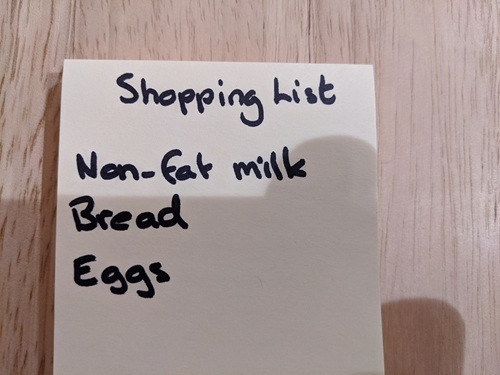

---
lab:
    title: 'Read text in images'
    description: 'Use optical character recognition (OCR) in the Azure AI Vision Image Analysis service to locate and extract text in images.'
---

# Read text in images

Optical character recognition (OCR) is a subset of computer vision that deals with reading text in images and documents. The **Azure AI Vision** Image Analysis service provides an API for reading text, which you'll explore in this exercise.

> **Note**: This exercise is based on pre-release SDK software, which may be subject to change. Where necessary, we've used specific versions of packages; which may not reflect the latest available versions. You may experience some unexpected behavior, warnings, or errors.

While this exercise is based on the Azure Vision Analysis Python SDK, you can develop vision applications using multiple language-specific SDKs; including:

* [Azure AI Vision Analysis for JavaScript](https://www.npmjs.com/package/@azure-rest/ai-vision-image-analysis)
* [Azure AI Vision Analysis for Microsoft .NET](https://www.nuget.org/packages/Azure.AI.Vision.ImageAnalysis)
* [Azure AI Vision Analysis for Java](https://mvnrepository.com/artifact/com.azure/azure-ai-vision-imageanalysis)

This exercise takes approximately **30** minutes.

## Provision an Azure AI Vision resource

If you don't already have one in your subscription, you'll need to provision an Azure AI Vision resource.

> **Note**: In this exercise, you'll use a standalone **Computer Vision** resource. You can also use Azure AI Vision services in an *Azure AI Services* multi-service resource, either directly or in an *Azure AI Foundry* project.

1. Open the [Azure portal](https://portal.azure.com) at `https://portal.azure.com`, and sign in using your Azure credentials. Close any welcome messages or tips that are displayed.
1. Select **Create a resource**.
1. In the search bar, search for `Computer Vision`, select **Computer Vision**, and create the resource with the following settings:
    - **Subscription**: *Your Azure subscription*
    - **Resource group**: *Create or select a resource group*
    - **Region**: *Choose from **East US**, **West US**, **France Central**, **Korea Central**, **North Europe**, **Southeast Asia**, **West Europe**, or **East Asia**\**
    - **Name**: *A valid name for your Computer Vision resource*
    - **Pricing tier**: Free F0

    \*Azure AI Vision 4.0 full feature sets are currently only available in these regions.

1. Select the required checkboxes and create the resource.
1. Wait for deployment to complete, and then view the deployment details.
1. When the resource has been deployed, go to it and under the **Resource management** node in the navigation pane, view its **Keys and Endpoint** page. You will need the endpoint and one of the keys from this page in the next procedure.

## Develop a text extraction app with the Azure AI Vision SDK

In this exercise, you'll complete a partially implemented client application that uses the Azure AI Vision SDK to extract text from images.

### Prepare the application configuration

1. In the Azure portal, use the **[\>_]** button to the right of the search bar at the top of the page to create a new Cloud Shell in the Azure portal, selecting a ***PowerShell*** environment with no storage in your subscription.

    The cloud shell provides a command-line interface in a pane at the bottom of the Azure portal.

    > **Note**: If you have previously created a cloud shell that uses a *Bash* environment, switch it to ***PowerShell***.

    > **Note**: If the portal asks you to select a storage to persist your files, choose **No storage account required**, select the subscription you are using and press **Apply**.

1. In the cloud shell toolbar, in the **Settings** menu, select **Go to Classic version** (this is required to use the code editor).

    **<font color="red">Ensure you've switched to the classic version of the cloud shell before continuing.</font>**

1. Resize the cloud shell pane so you can still see the **Keys and Endpoint** page for your Computer Vision resource.

    > **Tip**" You can resize the pane by dragging the top border. You can also use the minimize and maximize buttons to switch between the cloud shell and the main portal interface.

1. In the cloud shell pane, enter the following commands to clone the GitHub repo containing the code files for this exercise (type the command, or copy it to the clipboard and then right-click in the command line and paste as plain text):

    ```
    rm -r mslearn-ai-vision -f
    git clone https://github.com/MicrosoftLearning/mslearn-ai-vision
    ```

    > **Tip**: As you paste commands into the cloudshell, the output may take up a large amount of the screen buffer. You can clear the screen by entering the `cls` command to make it easier to focus on each task.

1. After the repo has been cloned, use the following command to navigate to the application code files:

    ```
   cd mslearn-ai-vision/Labfiles/ocr/python/read-text
   ls -a -l
    ```

    The folder contains application configuration and code files for your app. It also contains an **/images** subfolder, which contains some image files for your app to analyze.

1. Install the Azure AI Vision SDK package and other required packages by running the following commands:

    ```
   python -m venv labenv
   ./labenv/bin/Activate.ps1
   pip install -r requirements.txt azure-ai-vision-imageanalysis==1.0.0
    ```

1. Enter the following command to edit the configuration file for your app:

    ```
   code .env
    ```

    The file is opened in a code editor.

1. In the code file, update the configuration values it contains to reflect the **endpoint** and an authentication **key** for your Computer Vision resource (copied from its **Keys and Endpoint** page in the Azure portal).
1. After you've replaced the placeholders, use the **CTRL+S** command to save your changes and then use the **CTRL+Q** command to close the code editor while keeping the cloud shell command line open.

### Add code to read text from an image

1. In the cloud shell command line, enter the following command to open the code file for the client application:

    ```
   code read-text.py
    ```

    > **Tip**: You might want to maximize the cloud shell pane and move the split-bar between the command line cosole and the code editor so you can see the code more easily.

1. In the code file, find the comment **Import namespaces**, and add the following code to import the namespaces you will need to use the Azure AI Vision SDK:

    ```python
   # import namespaces
   from azure.ai.vision.imageanalysis import ImageAnalysisClient
   from azure.ai.vision.imageanalysis.models import VisualFeatures
   from azure.core.credentials import AzureKeyCredential
    ```

1. In the **Main** function, the code to load the configuration settings and determine the file to be analyzed has been provided. Then find the comment **Authenticate Azure AI Vision client** and add the following language-specific code to create and authenticate an Azure AI Vision Image Analysis client object:

    ```python
   # Authenticate Azure AI Vision client
   cv_client = ImageAnalysisClient(
        endpoint=ai_endpoint,
        credential=AzureKeyCredential(ai_key))
    ```

1. In the **Main** function, under the code you just added, find the comment **Read text in image** and add the following code to use the Image Analysis client to read the text in the image:

    ```python
   # Read text in image
   with open(image_file, "rb") as f:
        image_data = f.read()
   print (f"\nReading text in {image_file}")

   result = cv_client.analyze(
        image_data=image_data,
        visual_features=[VisualFeatures.READ])
    ```

1. Find the comment **Print the text** and add the following code (including the final comment) to print the lines of text that were found and call a function to annotate them in the image (using the **bounding_polygon** returned for each line of text):

    ```python
   # Print the text
   if result.read is not None:
        print("\nText:")
    
        for line in result.read.blocks[0].lines:
            print(f" {line.text}")        
        # Annotate the text in the image
        annotate_lines(image_file, result.read)

        # Find individual words in each line
        
    ```

1. Save your changes (*CTRL+S*) but keep the code editor open in case you need to fix any typo's.

1. Resize the panes so you can see more of the console, then enter the following command to run the program:

    ```
   python read-text.py images/Lincoln.jpg
    ```

1. The program reads the text in the specified image file (*images/Lincoln.jpg*), which looks like this:

    

1. In the **read-text** folder, a **lines.jpg** image has been created. Use the (Azure cloud shell-specific) **download** command to download it:

    ```
   download lines.jpg
    ```

    The download command creates a popup link at the bottom right of your browser, which you can select to download and open the file. The image should look simlar to this:

    

1. Run the program again, this time specifying the parameter *images/Business-card.jpg* to extract text from the following image:

    

    ```
   python read-text.py images/Business-card.jpg
    ```

1. Download and view the resulting **lines.jpg** file:

    ```
   download lines.jpg
    ```

1. Run the program one more time, this time specifying the parameter *images/Note.jpg* to extract text from this image:

    

    ```
   python read-text.py images/Note.jpg
    ```

1. Download and view the resulting **lines.jpg** file:

    ```
   download lines.jpg
    ```

### Add code to return the position of individual words

1. Resize the panes so you can see more of the code file. Then find the comment **Find individual words in each line** and add the following code (being careful to maintain the correct indentation level):

    ```python
   # Find individual words in each line
   print ("\nIndividual words:")
   for line in result.read.blocks[0].lines:
        for word in line.words:
            print(f"  {word.text} (Confidence: {word.confidence:.2f}%)")
   # Annotate the words in the image
   annotate_words(image_file, result.read)
    ```

1. Save your changes (*CTRL+S*). Then, in the command line pane, rerun the program to extract text from *images/Lincoln.jpg*.
1. Observe the output, which should include each individual word in the image, and the confidence associated with their prediction.
1. In the **read-text** folder, a **words.jpg** image has been created. Use the (Azure cloud shell-specific) **download** command to download and view it:

    ```
   download words.jpg
    ```

1. Rerun the program for *images/Business-card.jpg* and *images/Note.jpg*; viewing the **words.jpg** file generated for each image.

## Clean up resources

If you've finished exploring Azure AI Vision, you should delete the resources you have created in this exercise to avoid incurring unnecessary Azure costs:

1. Open the Azure portal at `https://portal.azure.com`, and sign in using the Microsoft account associated with your Azure subscription.

1. In the top search bar, search for *Computer Vision*, and select the Computer Vision resource you created in this lab.

1. On the resource page, select **Delete** and follow the instructions to delete the resource.
