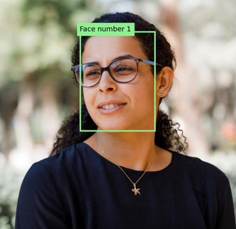
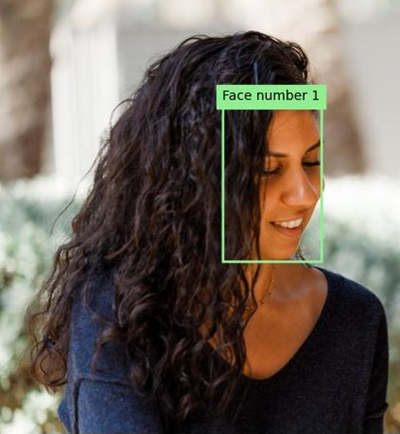
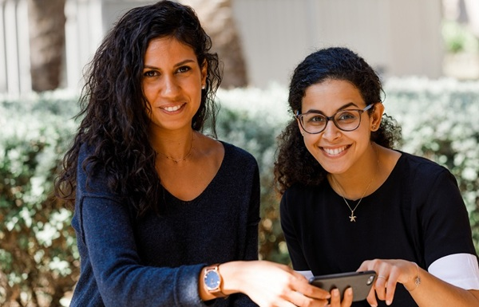
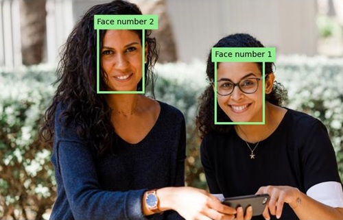

---
lab:
    title: 'Detect and analyze faces'
    description: 'Use the Azure AI Vision Face service to implement face detection and analysis solutions.'
---

# Detect and analyze faces

The ability to detect and analyze human faces is a core AI capability. In this exercise, you'll explore the **Face** service to work with faces.

> **Note**: This exercise is based on pre-release SDK software, which may be subject to change. Where necessary, we've used specific versions of packages; which may not reflect the latest available versions. You may experience some unexpected behavior, warnings, or errors.

While this exercise is based on the Azure Vision Face Python SDK, you can develop vision applications using multiple language-specific SDKs; including:

* [Azure AI Vision Face for JavaScript](https://www.npmjs.com/package/@azure-rest/ai-vision-face)
* [Azure AI Vision Face for Microsoft .NET](https://www.nuget.org/packages/Azure.AI.Vision.Face)
* [Azure AI Vision Face for Java](https://central.sonatype.com/artifact/com.azure/azure-ai-vision-face)

This exercise takes approximately **30** minutes.

> **Note**: Capabilities of Azure AI services that return personally identifiable information are restricted to customers who have been granted [limited access](https://learn.microsoft.com/legal/cognitive-services/computer-vision/limited-access-identity). This exercise does not include facial recognition tasks, and can be completed without requesting any additional access to restricted features.

## Provision an Azure AI Face API resource

If you don't already have one in your subscription, you'll need to provision an Azure AI Face API resource.

> **Note**: In this exercise, you'll use a standalone **Face** resource. You can also use Azure AI Face services in an *Azure AI Services* multi-service resource, either directly or in an *Azure AI Foundry* project.

1. Open the [Azure portal](https://portal.azure.com) at `https://portal.azure.com`, and sign in using your Azure credentials. Close any welcome messages or tips that are displayed.
1. Select **Create a resource**.
1. In the search bar, search for `Face`, select **Face**, and create the resource with the following settings:
    - **Subscription**: *Your Azure subscription*
    - **Resource group**: *Create or select a resource group*
    - **Region**: *Choose any available region*
    - **Name**: *A valid name for your Face resource*
    - **Pricing tier**: Free F0

1. Create the resource and wait for deployment to complete, and then view the deployment details.
1. When the resource has been deployed, go to it and under the **Resource management** node in the navigation pane, view its **Keys and Endpoint** page. You will need the endpoint and one of the keys from this page in the next procedure.

## Develop a facial analysis app with the Face SDK

In this exercise, you'll complete a partially implemented client application that uses the Azure Face SDK to detect and analyze human faces in images.

### Prepare the application configuration

1. In the Azure portal, use the **[\>_]** button to the right of the search bar at the top of the page to create a new Cloud Shell in the Azure portal, selecting a ***PowerShell*** environment with no storage in your subscription.

    The cloud shell provides a command-line interface in a pane at the bottom of the Azure portal.

    > **Note**: If you have previously created a cloud shell that uses a *Bash* environment, switch it to ***PowerShell***.

    > **Note**: If the portal asks you to select a storage to persist your files, choose **No storage account required**, select the subscription you are using and press **Apply**.

1. In the cloud shell toolbar, in the **Settings** menu, select **Go to Classic version** (this is required to use the code editor).

    **<font color="red">Ensure you've switched to the classic version of the cloud shell before continuing.</font>**

1. Resize the cloud shell pane so you can still see the **Keys and Endpoint** page for your Face resource.

    > **Tip**" You can resize the pane by dragging the top border. You can also use the minimize and maximize buttons to switch between the cloud shell and the main portal interface.

1. In the cloud shell pane, enter the following commands to clone the GitHub repo containing the code files for this exercise (type the command, or copy it to the clipboard and then right-click in the command line and paste as plain text):

    ```
    rm -r mslearn-ai-vision -f
    git clone https://github.com/MicrosoftLearning/mslearn-ai-vision
    ```

    > **Tip**: As you paste commands into the cloudshell, the output may take up a large amount of the screen buffer. You can clear the screen by entering the `cls` command to make it easier to focus on each task.

1. After the repo has been cloned, use the following command to navigate to the application code files:

    ```
   cd mslearn-ai-vision/Labfiles/face/python/face-api
   ls -a -l
    ```

    The folder contains application configuration and code files for your app. It also contains an **/images** subfolder, which contains some image files for your app to analyze.

1. Install the Azure AI Vision SDK package and other required packages by running the following commands:

    ```
   python -m venv labenv
   ./labenv/bin/Activate.ps1
   pip install -r requirements.txt azure-ai-vision-face==1.0.0b2
    ```

1. Enter the following command to edit the configuration file for your app:

    ```
   code .env
    ```

    The file is opened in a code editor.

1. In the code file, update the configuration values it contains to reflect the **endpoint** and an authentication **key** for your Face resource (copied from its **Keys and Endpoint** page in the Azure portal).
1. After you've replaced the placeholders, use the **CTRL+S** command to save your changes and then use the **CTRL+Q** command to close the code editor while keeping the cloud shell command line open.

### Add code to create a Face API client

1. In the cloud shell command line, enter the following command to open the code file for the client application:

    ```
   code analyze-faces.py
    ```

    > **Tip**: You might want to maximize the cloud shell pane and move the split-bar between the command line cosole and the code editor so you can see the code more easily.

1. In the code file, find the comment **Import namespaces**, and add the following code to import the namespaces you will need to use the Azure AI Vision SDK:

    ```python
   # Import namespaces
   from azure.ai.vision.face import FaceClient
   from azure.ai.vision.face.models import FaceDetectionModel, FaceRecognitionModel, FaceAttributeTypeDetection01
   from azure.core.credentials import AzureKeyCredential
    ```

1. In the **Main** function, note that the code to load the configuration settings and determine the image to be analyzed has been provided. Then find the comment **Authenticate Face client** and add the following code to create and authenticate a **FaceClient** object:

    ```python
   # Authenticate Face client
   face_client = FaceClient(
        endpoint=cog_endpoint,
        credential=AzureKeyCredential(cog_key))
    ```

### Add code to detect and analyze faces

1. In the code file for your application, in the **Main** function, find the comment **Specify facial features to be retrieved** and add the following code:

    ```python
   # Specify facial features to be retrieved
   features = [FaceAttributeTypeDetection01.HEAD_POSE,
                FaceAttributeTypeDetection01.OCCLUSION,
                FaceAttributeTypeDetection01.ACCESSORIES]
    ```

1. In the **Main** function, under the code you just added, find the comment **Get faces** and add the following code to print the facial feature information and call a function that annotates the image with the bounding box for each detected face (based on the **face_rectangle** property of each face):

    ```Python
   # Get faces
   with open(image_file, mode="rb") as image_data:
        detected_faces = face_client.detect(
            image_content=image_data.read(),
            detection_model=FaceDetectionModel.DETECTION01,
            recognition_model=FaceRecognitionModel.RECOGNITION01,
            return_face_id=False,
            return_face_attributes=features,
        )

   face_count = 0
   if len(detected_faces) > 0:
        print(len(detected_faces), 'faces detected.')
        for face in detected_faces:
    
            # Get face properties
            face_count += 1
            print('\nFace number {}'.format(face_count))
            print(' - Head Pose (Yaw): {}'.format(face.face_attributes.head_pose.yaw))
            print(' - Head Pose (Pitch): {}'.format(face.face_attributes.head_pose.pitch))
            print(' - Head Pose (Roll): {}'.format(face.face_attributes.head_pose.roll))
            print(' - Forehead occluded?: {}'.format(face.face_attributes.occlusion["foreheadOccluded"]))
            print(' - Eye occluded?: {}'.format(face.face_attributes.occlusion["eyeOccluded"]))
            print(' - Mouth occluded?: {}'.format(face.face_attributes.occlusion["mouthOccluded"]))
            print(' - Accessories:')
            for accessory in face.face_attributes.accessories:
                print('   - {}'.format(accessory.type))
            # Annotate faces in the image
            annotate_faces(image_file, detected_faces)
    ```

1. Examine the code you added to the **Main** function. It analyzes an image file and detects any faces it contains, including attributes for head pose, occlusion, and the presence of accessories such as glasses. Additionally, a function is called to annotate the original image with a bounding box for each detected face.
1. Save your changes (*CTRL+S*) but keep the code editor open in case you need to fix any typo's.

1. Resize the panes so you can see more of the console, then enter the following command to run the program with the argument *images/face1.jpg*:

    ```
   python analyze-faces.py images/face1.jpg
    ```

    The app runs and analyzes the following image:

    

1. Observe the output, which should include the ID and attributes of each face detected. 
1. Note that an image file named **detected_faces.jpg** is also generated. Use the (Azure cloud shell-specific) **download** command to download it:

    ```
   download detected_faces.jpg
    ```

    The download command creates a popup link at the bottom right of your browser, which you can select to download and open the file. The image should look simlar to this:

    

1. Run the program again, this time specifying the parameter *images/face2.jpg* to extract text from the following image:

    

    ```
   python analyze-faces.py images/face2.jpg
    ```

1. Download and view the resulting **detected_faces.jpg** file:

    ```
   download detected_faces.jpg
    ```

    The resulting image should look like this:

    

1. Run the program one more time, this time specifying the parameter *images/faces.jpg* to extract text from this image:

    

    ```
   python analyze-faces.py images/faces.jpg
    ```

1. Download and view the resulting **detected_faces.jpg** file:

    ```
   download detected_faces.jpg
    ```

    The resulting image should look like this:

    

## Clean up resources

If you've finished exploring Azure AI Vision, you should delete the resources you have created in this exercise to avoid incurring unnecessary Azure costs:

1. Open the Azure portal at `https://portal.azure.com`, and in the top search bar, search for the resources you created in this lab.

1. On the resource page, select **Delete** and follow the instructions to delete the resource. Alternatively, you can delete the entire resource group to clean up all resources at the same time.
