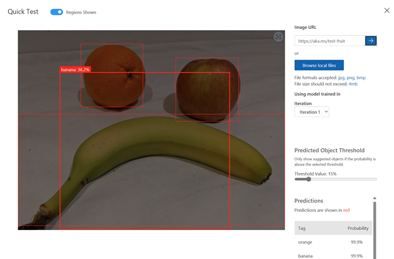
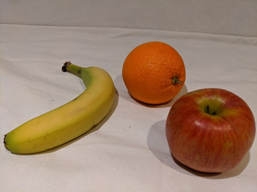
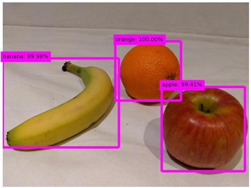

---
lab:
    title: 'Detect objects in images'
    description: 'Use the Azure AI Custom Vision service to train an object detection model.'
---

# Detect objects in images

The **Azure AI Custom Vision** service enables you to create computer vision models that are trained on your own images. You can use it to train *image classification* and *object detection* models; which you can then publish and consume from applications.

In this exercise, you will use the Custom Vision service to train an *object detection* model that can detect and locate three classes of fruit (apple, banana, and orange) in an image.

While this exercise is based on the Azure Custom Vision Python SDK, you can develop vision applications using multiple language-specific SDKs; including:

* [Azure Custom Vision for JavaScript (training)](https://www.npmjs.com/package/@azure/cognitiveservices-customvision-training)
* [Azure Custom Vision for JavaScript (prediction)](https://www.npmjs.com/package/@azure/cognitiveservices-customvision-prediction)
* [Azure Custom Vision for Microsoft .NET (training)](https://www.nuget.org/packages/Microsoft.Azure.CognitiveServices.Vision.CustomVision.Training/)
* [Azure Custom Vision for Microsoft .NET (prediction)](https://www.nuget.org/packages/Microsoft.Azure.CognitiveServices.Vision.CustomVision.Prediction/)
* [Azure Custom Vision for Java (training)](https://search.maven.org/artifact/com.azure/azure-cognitiveservices-customvision-training/1.1.0-preview.2/jar)
* [Azure Custom Vision for Java (prediction)](https://search.maven.org/artifact/com.azure/azure-cognitiveservices-customvision-prediction/1.1.0-preview.2/jar)

This exercise takes approximately **45** minutes.

## Create Custom Vision resources

Before you can train a model, you will need Azure resources for *training* and *prediction*. You can create **Custom Vision** resources for each of these tasks, or you can create a single resource and use it for both. In this exercise, you'll create **Custom Vision** resources for training and prediction.

1. Open the [Azure portal](https://portal.azure.com) at `https://portal.azure.com`, and sign in using your Azure credentials. Close any welcome messages or tips that are displayed.
1. Select **Create a resource**.
1. In the search bar, search for `Custom Vision`, select **Custom Vision**, and create the resource with the following settings:
    - **Create options**: Both
    - **Subscription**: *Your Azure subscription*
    - **Resource group**: *Create or select a resource group*
    - **Region**: *Choose any available region*
    - **Name**: *A valid name for your Custom Vision resource*
    - **Training pricing tier**: F0
    - **Prediction pricing tier**: F0

1. Create the resource and wait for deployment to complete, and then view the deployment details. Note that two Custom Vision resources are provisioned; one for training, and another for prediction.

    > **Note**: Each resource has its own *endpoint* and *keys*, which are used to manage access from your code. To train an image classification model, your code must use the *training* resource (with its endpoint and key); and to use the trained model to predict image classes, your code must use the *prediction* resource (with its endpoint and key).

1. When the resources have been deployed, go to the resource group to view them. You should see two custom vision resources, one with the suffix ***-Prediction***.

## Create a Custom Vision project in the Custom Vision portal

To train an object detection model, you need to create a Custom Vision project based on your training resource. To do this, you'll use the Custom Vision portal.

1. Open a new browser tab (keeping the Azure portal tab open - you'll return to it later).
1. In the new browser tab, open the [Custom Vision portal](https://customvision.ai) at `https://customvision.ai`. If prompted, sign in using your Azure credentials and agree to the terms of service.
1. Create a new project with the following settings:
    - **Name**: `Detect Fruit`
    - **Description**: `Object detection for fruit.`
    - **Resource**: *Your Custom Vision resource*
    - **Project Types**: Object Detection
    - **Domains**: General
1. Wait for the project to be created and opened in the browser.

## Upload and tag images

Now that you have an object detection project, you can upload and tag images to train a model.

### Upload and tag images in the Custom Vision portal

The Custom Vision portal includes visual tools that you can use to upload images and tag regions within them that contain multiple types of object.

1. In a new browser tab, download the [training images](https://github.com/MicrosoftLearning/mslearn-ai-vision/raw/main/Labfiles/object-detection/training-images.zip) from `https://github.com/MicrosoftLearning/mslearn-ai-vision/raw/main/Labfiles/object-detection/training-images.zip` and extract the zip folder to view its contents. This folder contains images of fruit.
1. In the Custom Vision portal, in your object detection project, select **Add images** and upload all of the images in the extracted folder.
1. After the images have been uploaded, select the first one to open it.
1. Hold the mouse over any object in the image until an automatically detected region is displayed like the image below. Then select the object, and if necessary resize the region to surround it.

    

    Alternatively, you can simply drag around the object to create a region.

1. When the region surrounds the object, add a new tag with the appropriate object type (*apple*, *banana*, or *orange*) as shown here:

    

1. Select and tag each other object in the image, resizing the regions and adding new tags as required.

    

1. Use the **>** link on the right to go to the next image, and tag its objects. Then just keep working through the entire image collection, tagging each apple, banana, and orange.

1. When you have finished tagging the last image, close the **Image Detail** editor. On the **Training Images** page, under **Tags**, select **Tagged** to see all of your tagged images:


### Use the Custom Vision SDK to upload images

You can use the UI in the Custom Vision portal to tag your images, but many AI development teams use other tools that generate files containing information about tags and object regions in images. In scenarios like this, you can use the Custom Vision training API to upload tagged images to the project.

1. Click the *settings* (&#9881;) icon at the top right of the **Training Images** page in the Custom Vision portal to view the project settings.
1. Under **General** (on the left), note the **Project Id** that uniquely identifies this project.
1. On the right, under **Resources** note that the **Key** and **Endpoint** are shown. These are the details for the *training* resource (you can also obtain this information by viewing the resource in the Azure portal).
1. Return to the browser tab containing the Azure portal (keeping the Custom Vision portal tab open - you'll return to it later).
1. In the Azure portal, use the **[\>_]** button to the right of the search bar at the top of the page to create a new Cloud Shell in the Azure portal, selecting a ***PowerShell*** environment with no storage in your subscription.

    The cloud shell provides a command-line interface in a pane at the bottom of the Azure portal.

    > **Note**: If you have previously created a cloud shell that uses a *Bash* environment, switch it to ***PowerShell***.

    > **Note**: If the portal asks you to select a storage to persist your files, choose **No storage account required**, select the subscription you are using and press **Apply**.

1. In the cloud shell toolbar, in the **Settings** menu, select **Go to Classic version** (this is required to use the code editor).

    **<font color="red">Ensure you've switched to the classic version of the cloud shell before continuing.</font>**

1. Resize the cloud shell pane so you can see more of it.

    > **Tip**" You can resize the pane by dragging the top border. You can also use the minimize and maximize buttons to switch between the cloud shell and the main portal interface.

1. In the cloud shell pane, enter the following commands to clone the GitHub repo containing the code files for this exercise (type the command, or copy it to the clipboard and then right-click in the command line and paste as plain text):

    ```
    rm -r mslearn-ai-vision -f
    git clone https://github.com/MicrosoftLearning/mslearn-ai-vision
    ```

    > **Tip**: As you paste commands into the cloudshell, the ouput may take up a large amount of the screen buffer. You can clear the screen by entering the `cls` command to make it easier to focus on each task.

1. After the repo has been cloned, use the following command to navigate to the application code files:

    ```
   cd mslearn-ai-vision/Labfiles/object-detection/python/train-detector
   ls -a -l
    ```

    The folder contains application configuration and code files for your app. It also contains a **tagged-images.json** file which contains bounding box coordinates for objects in multiple images, and an **/images** subfolder, which contains the images.

1. Install the Azure AI Custom Vision SDK package for training and any other required packages by running the following commands:

    ```
   python -m venv labenv
   ./labenv/bin/Activate.ps1
   pip install -r requirements.txt azure-cognitiveservices-vision-customvision
    ```

1. Enter the following command to edit the configuration file for your app:

    ```
   code .env
    ```

    The file is opened in a code editor.

1. In the code file, update the configuration values it contains to reflect the **Endpoint** and an authentication **Key** for your Custom Vision *training* resource, and the **Project ID** for the custom vision project you created previously.
1. After you've replaced the placeholders, within the code editor, use the **CTRL+S** command to save your changes and then use the **CTRL+Q** command to close the code editor while keeping the cloud shell command line open.
1. In the cloud shell command line, enter the following command to open the **tagged-images.json** file to see the tagging information for the image files in the **/images** subfolder:

    ```
   code tagged-images.json
    ```
    
     JSON defines a list of images, each containing one or more tagged regions. Each tagged region includes a tag name, and the top and left coordinates and width and height dimensions of the bounding box containing the tagged object.

    > **Note**: The coordinates and dimensions in this file indicate relative points on the image. For example, a *height* value of 0.7 indicates a box that is 70% of the height of the image. Some tagging tools generate other formats of file in which the coordinate and dimension values represent pixels, inches, or other units of measurements.

1. Close the JSON file without saving any changes (*CTRL_Q*).

1. In the cloud shell command line, enter the following command to open the code file for the client application:

    ```
   code add-tagged-images.py
    ```

1. Note the following details in the code file:
    - The namespaces for the Azure AI Custom Vision SDK are imported.
    - The **Main** function retrieves the configuration settings, and uses the key and endpoint to create an authenticated **CustomVisionTrainingClient**, which is then used with the project ID to create a **Project** reference to your project.
    - The **Upload_Images** function extracts the tagged region information from the JSON file and uses it to create a batch of images with regions, which it then uploads to the project.

1. Close the code editor (*CTRL+Q*) and enter the following command to run the program:

    ```
   python add-tagged-images.py
    ```

1. Wait for the program to end.
1. Switch back to the browser tab containing the Custom Vision portal (keeping the Azure portal cloud shell tab open), and view the **Training Images** page for your project (refreshing the browser if necessary).
1. Verify that some new tagged images have been added to the project.

## Train and test a model

Now that you've tagged the images in your project, you're ready to train a model.

1. In the Custom Vision project, click **Train** (&#9881;<sub>&#9881;</sub>) to train an object detection model using the tagged images. Select the **Quick Training** option.
1. Wait for training to complete (it might take ten minutes or so).

    > **Tip**: The Azure cloud shell has a 20-minute inactivity timeout, after which the session is abandoned. While you wait for training to finish, occassionally return to the cloud shell and enter a colland like `ls` to keep the session active.

1. In the Custom Vision portal, when training has finished, review the *Precision*, *Recall*, and *mAP* performance metrics - these measure the prediction accuracy of the object detection model, and should all be high.
1. At the top right of the page, click **Quick Test**, and then in the **Image URL** box, type `https://aka.ms/test-fruit` and click the *quick test image* (&#10132;) button.
1. View the prediction that is generated.

    

1. Close the **Quick Test** window.

## Use the object detector in a client application

Now you're ready to publish your trained model and use it in a client application.

### Publish the object detection model

1. In the Custom Vision portal, on the **Performance** page,  click **&#128504; Publish** to publish the trained model with the following settings:
    - **Model name**: `fruit-detector`
    - **Prediction Resource**: *The **prediction** resource you created previously which ends with "-Prediction" (<u>not</u> the training resource)*.
1. At the top left of the **Project Settings** page, click the *Projects Gallery* (&#128065;) icon to return to the Custom Vision portal home page, where your project is now listed.
1. On the Custom Vision portal home page, at the top right, click the *settings* (&#9881;) icon to view the settings for your Custom Vision service. Then, under **Resources**, find your *prediction* resource which ends with "-Prediction" (<u>not</u> the training resource) to determine its **Key** and **Endpoint** values (you can also obtain this information by viewing the resource in the Azure portal).

## Use the image classifier from a client application

Now that you've published the image classification model, you can use it from a client application. Once again, you can choose to use **C#** or **Python**.

1. Return to the browser tab containing the Azure portal and the cloud shell pane.
1. In cloud shell, run the following commands to switch to the folder for you client application and view the files it contains:

    ```
   cd ../test-detector
   ls -a -l
    ```

    The folder contains application configuration and code files for your app. It also contains the following **produce.jpg** image file, which you'll use to test your model.

    

1. Install the Azure AI Custom Vision SDK package for prediction and any other required packages by running the following commands:

    ```
   python -m venv labenv
   ./labenv/bin/Activate.ps1
   pip install -r requirements.txt azure-cognitiveservices-vision-customvision
    ```

1. Enter the following command to edit the configuration file for your app:

    ```
   code .env
    ```

    The file is opened in a code editor.

1. Update the configuration values to reflect the **Endpoint** and **Key** for your Custom Vision *<u>prediction</u>* resource, the **Project ID** for the object detection project, and the name of your published model (which should be *fruit-detector*). Save your changes (*CTRL+S*) and close the code editor (*CTRL+Q*).

1. In the cloud shell command line, enter the following command to open the code file for the client application:

    ```
   code test-detector.py
    ```

1. Review the code, noting the following details:
    - The namespaces for the Azure AI Custom Vision SDK are imported.
    - The **Main** function retrieves the configuration settings, and uses the key and endpoint to create an authenticated **CustomVisionPredictionClient**.
    - The prediction client object is used to get object detection predictions for the **produce.jpg** image, specifying the project ID and model name in the request. The predicted tagged regions are then drawn on the image, and the result is saved as **output.jpg**.
1. Close the code editor and enter the following command to run the program:

    ```
   python test-detector.py
    ```

1. Review the program output, which lists each object detected in the image.
1. Note that an image file named **output.jpg** is generated. Use the (Azure cloud shell-specific) **download** command to download it:

    ```
   download output.jpg
    ```

    The download command creates a popup link at the bottom right of your browser, which you can select to download and open the file. The image should look simlar to this:

    

## Clean up resources

If you're not using the Azure resources created in this lab for other training modules, you can delete them to avoid incurring further charges.

1. Open the Azure portal at `https://portal.azure.com`, and in the top search bar, search for the resources you created in this lab.

1. On the resource page, select **Delete** and follow the instructions to delete the resource. Alternatively, you can delete the entire resource group to clean up all resources at the same time.
   
## More information

For more information about object detection with the Custom Vision service, see the [Custom Vision documentation](https://docs.microsoft.com/azure/cognitive-services/custom-vision-service/).
