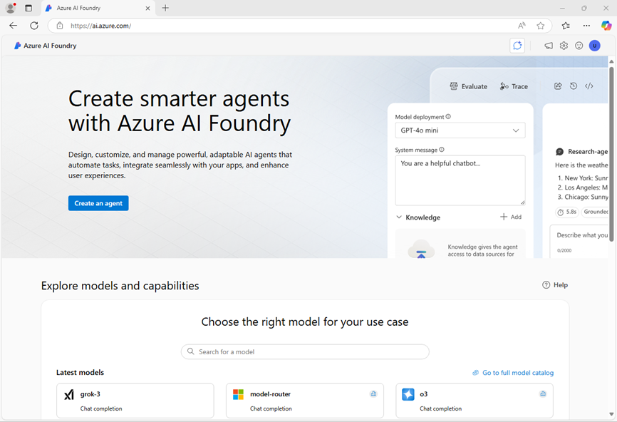
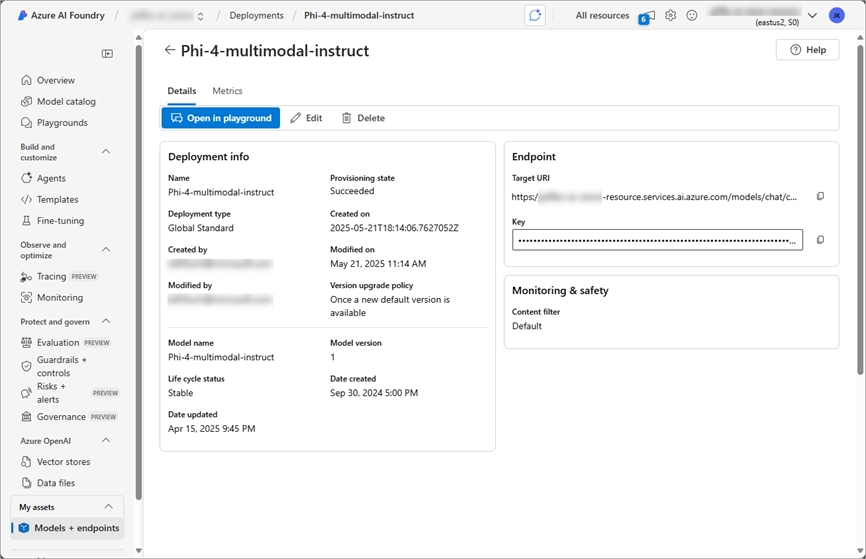
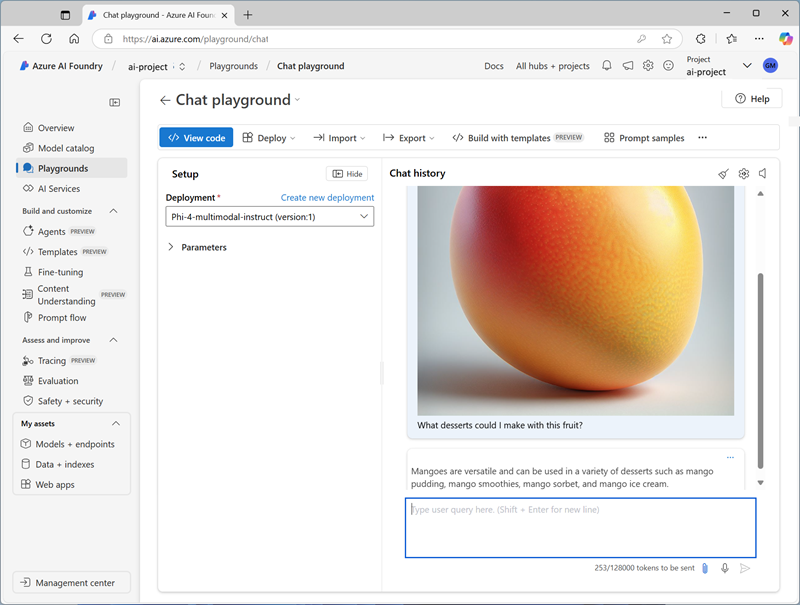

---
lab:
    title: 'Develop a vision-enabled chat app'
    description: 'Use Azure AI Foundry to build a generative AI app that supports image input.'
---

# Develop a vision-enabled chat app

In this exercise, you use the *Phi-4-multimodal-instruct* generative AI model to generate responses to prompts that include images. You'll develop an app that provides AI assistance with fresh produce in a grocery store by using Azure AI Foundry and the Azure AI Model Inference service.

> **Note**: This exercise is based on pre-release SDK software, which may be subject to change. Where necessary, we've used specific versions of packages; which may not reflect the latest available versions. You may experience some unexpected behavior, warnings, or errors.

While this exercise is based on the Azure AI Foundry Python SDK, you can develop AI chat applications using multiple language-specific SDKs; including:

- [Azure AI Projects for Python](https://pypi.org/project/azure-ai-projects)
- [Azure AI Projects for Microsoft .NET](https://www.nuget.org/packages/Azure.AI.Projects)
- [Azure AI Projects for JavaScript](https://www.npmjs.com/package/@azure/ai-projects)

This exercise takes approximately **30** minutes.

## Open Azure AI Foundry portal

Let's start by signing into Azure AI Foundry portal.

1. In a web browser, open the [Azure AI Foundry portal](https://ai.azure.com) at `https://ai.azure.com` and sign in using your Azure credentials. Close any tips or quick start panes that are opened the first time you sign in, and if necessary use the **Azure AI Foundry** logo at the top left to navigate to the home page, which looks similar to the following image (close the **Help** pane if it's open):

    

1. Review the information on the home page.

## Choose a model to start a project

An Azure AI *project* provides a collaborative workspace for AI development. Let's start by choosing a model that we want to work with and creating a project to use it in.

> **Note**: AI Foundry projects can be based on an *Azure AI Foundry* resource, which provides access to AI models (including Azure OpenAI), Azure AI services, and other resources for developing AI agents and chat solutions. Alternatively, projects can be based on *AI hub* resources; which include connections to Azure resources for secure storage, compute, and specialized tools. Azure AI Foundry based projects are great for developers who want to manage resources for AI agent or chat app development. AI hub based projects are more suitable for enterprise development teams working on complex AI solutions.

1. In the home page, in the **Explore models and capabilities** section, search for the `gpt-4o` model; which we'll use in our project.

1. In the search results, select the **gpt-4o** model to see its details, and then at the top of the page for the model, select **Use this model**.

1. When prompted to create a project, enter a valid name for your project and expand **Advanced options**.

1. Select **Customize** and specify the following settings for your hub:
    - **Azure AI Foundry resource**: *A valid name for your Azure AI Foundry resource*
    - **Subscription**: *Your Azure subscription*
    - **Resource group**: *Create or select a resource group*
    - **Region**: *Select any **AI Foundry recommended***\*

    > \* Some Azure AI resources are constrained by regional model quotas. In the event of a quota limit being exceeded later in the exercise, there's a possibility you may need to create another resource in a different region.

1. Select **Create** and wait for your project, including the gpt-4o model deployment you selected, to be created.

    > <font color="red"><b>IMPORTANT</b>:</font> Depending on your available quota for gpt-4o models you might receive a additional prompt to deploy the model to a resource in a different region. If this happens, do so, using the default settings. Later in the exercise you will <b><u>not</u></b> be able to use the default project endpoint - you must use the model-specific target URI.

1. When your project is created, your model will be displayed in the **Models + endpoints** page:

    

## Test the model in the playground

Now you can test your multimodal model deployment with an image-based prompt in the chat playground.

1. Select **Open in playground** on the model deployment page.

1. In a new browser tab, download [mango.jpeg](https://github.com/MicrosoftLearning/mslearn-ai-vision/raw/refs/heads/main/Labfiles/gen-ai-vision/mango.jpeg) from `https://github.com/MicrosoftLearning/mslearn-ai-vision/raw/refs/heads/main/Labfiles/gen-ai-vision/mango.jpeg` and save it to a folder on your local file system.

1. On the chat playground page, in the **Setup** pane, ensure that your **gpt-4o** model model deployment is selected.

1. In the main chat session panel, under the chat input box, use the attach button (**&#128206;**) to upload the *mango.jpeg* image file, and then add the text `What desserts could I make with this fruit?` and submit the prompt.

    

1. Review the response, which should hopefully provide relevant guidance for desserts you can make using a mango.

## Create a client application

Now that you've deployed the model, you can use the deployment in a client application.

### Prepare the application configuration

1. Open a new browser tab (keeping the Azure AI Foundry portal open in the existing tab). Then in the new tab, browse to the [Azure portal](https://portal.azure.com) at `https://portal.azure.com`; signing in with your Azure credentials if prompted.

    Close any welcome notifications to see the Azure portal home page.

1. Use the **[\>_]** button to the right of the search bar at the top of the page to create a new Cloud Shell in the Azure portal, selecting a ***PowerShell*** environment with no storage in your subscription.

    The cloud shell provides a command-line interface in a pane at the bottom of the Azure portal. You can resize or maximize this pane to make it easier to work in.

    > **Note**: If you have previously created a cloud shell that uses a *Bash* environment, switch it to ***PowerShell***.

1. In the cloud shell toolbar, in the **Settings** menu, select **Go to Classic version** (this is required to use the code editor).

    **<font color="red">Ensure you've switched to the classic version of the cloud shell before continuing.</font>**

1. In the cloud shell pane, enter the following commands to clone the GitHub repo containing the code files for this exercise (type the command, or copy it to the clipboard and then right-click in the command line and paste as plain text):

    ```
    rm -r mslearn-ai-vision -f
    git clone https://github.com/MicrosoftLearning/mslearn-ai-vision
    ```

    > **Tip**: As you paste commands into the cloudshell, the ouput may take up a large amount of the screen buffer. You can clear the screen by entering the `cls` command to make it easier to focus on each task.

1. After the repo has been cloned, navigate to the folder containing the application code files:  

    ```
   cd mslearn-ai-vision/Labfiles/gen-ai-vision/python
    ```

1. In the cloud shell command line pane, enter the following command to install the libraries you'll use:

    ```
   python -m venv labenv
   ./labenv/bin/Activate.ps1
   pip install -r requirements.txt azure-identity azure-ai-projects openai
    ```

1. Enter the following command to edit the configuration file that has been provided:

    ```
   code .env
    ```

    The file is opened in a code editor.

    > <font color="red"><b>IMPORTANT</b>:</font> If you deployed your gpt-4o model in the default region for your project, you can use the <b>Azure AI Foundry project</b> or <b>Azure OpenAI</b> endpoint on the <b>Overview</b> page for your project to connect to your model. If you had insufficient quota and deployed the model to another region, on the <b>Models + Endpoints</b> page, select your model and use the <b>Target URI</b> for your model.

1. In the code file, replace the **your_project_endpoint** placeholder with the appropriate endpoint for your model, and the **your_model_deployment** placeholder with the name you assigned to your gpt-4o model deployment.

1. After you've replaced the placeholders, in the code editor, use the **CTRL+S** command or **Right-click > Save** to save your changes and then use the **CTRL+Q** command or **Right-click > Quit** to close the code editor while keeping the cloud shell command line open.

### Write code to connect to your project and get a chat client for your model

> **Tip**: As you add code, be sure to maintain the correct indentation.

1. Enter the following command to edit the code file that has been provided:

    ```
   code chat-app.py
    ```

1. In the code file, note the existing statements that have been added at the top of the file to import the necessary SDK namespaces. Then, Find the comment **Add references**, add the following code to reference the namespaces in the libraries you installed previously:

    ```python
   # Add references
   from azure.identity import DefaultAzureCredential
   from azure.ai.projects import AIProjectClient
   from openai import AzureOpenAI
    ```

1. In the **main** function, under the comment **Get configuration settings**, note that the code loads the project connection string and model deployment name values you defined in the configuration file.
1. In the **main** function, under the comment **Get configuration settings**, note that the code loads the project connection string and model deployment name values you defined in the configuration file.
1. Find the comment **Initialize the project client**, and add the following code to connect to your Azure AI Foundry project:

    > **Tip**: Be careful to maintain the correct indentation level for your code.

    ```python
   # Initialize the project client
   project_client = AIProjectClient(            
            credential=DefaultAzureCredential(
                exclude_environment_credential=True,
                exclude_managed_identity_credential=True
            ),
            endpoint=project_endpoint,
        )
    ```

1. Find the comment **Get a chat client**, and add the following code to create a client object for chatting with a model:

    ```python
   # Get a chat client
   openai_client = project_client.get_openai_client(api_version="2024-10-21")
    ```

### Write code to submit a URL-based image prompt

1. Note that the code includes a loop to allow a user to input a prompt until they enter "quit". Then in the loop section, find the comment **Get a response to image input**, add the following code to submit a prompt that includes the following image:

    

    ```python
   # Get a response to image input
   image_url = "https://github.com/MicrosoftLearning/mslearn-ai-vision/raw/refs/heads/main/Labfiles/gen-ai-vision/orange.jpeg"
   image_format = "jpeg"
   request = Request(image_url, headers={"User-Agent": "Mozilla/5.0"})
   image_data = base64.b64encode(urlopen(request).read()).decode("utf-8")
   data_url = f"data:image/{image_format};base64,{image_data}"

   response = openai_client.chat.completions.create(
        model=model_deployment,
        messages=[
            {"role": "system", "content": system_message},
            { "role": "user", "content": [  
                { "type": "text", "text": prompt},
                { "type": "image_url", "image_url": {"url": data_url}}
            ] } 
        ]
   )
   print(response.choices[0].message.content)
    ```

1. Use the **CTRL+S** command to save your changes to the code file - don't close it yet though.

## Sign into Azure and run the app

1. In the cloud shell command-line pane, enter the following command to sign into Azure.

    ```
   az login
    ```

    **<font color="red">You must sign into Azure - even though the cloud shell session is already authenticated.</font>**

    > **Note**: In most scenarios, just using *az login* will be sufficient. However, if you have subscriptions in multiple tenants, you may need to specify the tenant by using the *--tenant* parameter. See [Sign into Azure interactively using the Azure CLI](https://learn.microsoft.com/cli/azure/authenticate-azure-cli-interactively) for details.
    
1. When prompted, follow the instructions to open the sign-in page in a new tab and enter the authentication code provided and your Azure credentials. Then complete the sign in process in the command line, selecting the subscription containing your Azure AI Foundry hub if prompted.

1. After you have signed in, enter the following command to run the application:

    ```
   python chat-app.py
    ```

1. When prompted, enter the following prompt:

    ```
   Suggest some recipes that include this fruit
    ```

1. Review the response. Then enter `quit` to exit the program.

### Modify the code to upload a local image file

1. In the code editor for your app code, in the loop section, find the code you added previously under the comment **Get a response to image input**. Then modify the code as follows, to upload this local image file:

    

    ```python
   # Get a response to image input
   script_dir = Path(__file__).parent  # Get the directory of the script
   image_path = script_dir / 'mystery-fruit.jpeg'
   mime_type = "image/jpeg"

   # Read and encode the image file
   with open(image_path, "rb") as image_file:
        base64_encoded_data = base64.b64encode(image_file.read()).decode('utf-8')

   # Include the image file data in the prompt
   data_url = f"data:{mime_type};base64,{base64_encoded_data}"
   response = openai_client.chat.completions.create(
            model=model_deployment,
            messages=[
                {"role": "system", "content": system_message},
                { "role": "user", "content": [  
                    { "type": "text", "text": prompt},
                    { "type": "image_url", "image_url": {"url": data_url}}
                ] } 
            ]
   )
   print(response.choices[0].message.content)
    ```

1. Use the **CTRL+S** command to save your changes to the code file. You can also close the code editor (**CTRL+Q**) if you like.

1. In the cloud shell command line pane beneath the code editor, enter the following command to run the app:

    ```
   python chat-app.py
    ```

1. When prompted, enter the following prompt:

    ```
   What is this fruit? What recipes could I use it in?
    ```

15. Review the response. Then enter `quit` to exit the program.

    > **Note**: In this simple app, we haven't implemented logic to retain conversation history; so the model will treat each prompt as a new request with no context of the previous prompt.

## Clean up

If you've finished exploring Azure AI Foundry portal, you should delete the resources you have created in this exercise to avoid incurring unnecessary Azure costs.

1. Open the [Azure portal](https://portal.azure.com) and view the contents of the resource group where you deployed the resources used in this exercise.
1. On the toolbar, select **Delete resource group**.
1. Enter the resource group name and confirm that you want to delete it.
