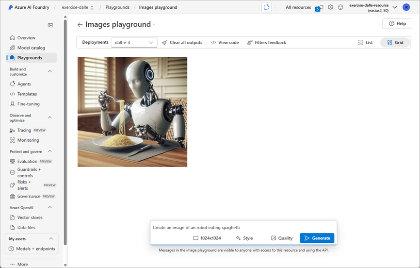

---
lab:
    title: 'Generate images with AI'
    description: 'Use an OpenAI a DALL-E model in Azure AI Foundry to generate images.'
---

# Generate images with AI

In this exercise, you use the OpenAI DALL-E generative AI model to generate images. You also use the OpenAI Python SDK to create a simple app to generate images based on your prompts.

> **Note**: This exercise is based on pre-release SDK software, which may be subject to change. Where necessary, we've used specific versions of packages; which may not reflect the latest available versions. You may experience some unexpected behavior, warnings, or errors.

While this exercise is based on the OpenAI Python SDK, you can develop AI chat applications using multiple language-specific SDKs; including:

* [OpenAI Projects for Microsoft .NET](https://www.nuget.org/packages/OpenAI)
* [OpenAI Projects for JavaScript](https://www.npmjs.com/package/openai)

This exercise takes approximately **30** minutes.

## Open Azure AI Foundry portal

Let's start by signing into Azure AI Foundry portal.

1. In a web browser, open the [Azure AI Foundry portal](https://ai.azure.com) at `https://ai.azure.com` and sign in using your Azure credentials. Close any tips or quick start panes that are opened the first time you sign in, and if necessary use the **Azure AI Foundry** logo at the top left to navigate to the home page, which looks similar to the following image (close the **Help** pane if it's open):

    

1. Review the information on the home page.

## Choose a model to start a project

An Azure AI *project* provides a collaborative workspace for AI development. Let's start by choosing a model that we want to work with and creating a project to use it in.

> **Note**: AI Foundry projects can be based on an *Azure AI Foundry* resource, which provides access to AI models (including Azure OpenAI), Azure AI services, and other resources for developing AI agents and chat solutions. Alternatively, projects can be based on *AI hub* resources; which include connections to Azure resources for secure storage, compute, and specialized tools. Azure AI Foundry based projects are great for developers who want to manage resources for AI agent or chat app development. AI hub based projects are more suitable for enterprise development teams working on complex AI solutions.

1. In the home page, in the **Explore models and capabilities** section, search for the `dall-e-3` model; which we'll use in our project.

1. In the search results, select the **dall-e-3** model to see its details, and then at the top of the page for the model, select **Use this model**.

1. When prompted to create a project, enter a valid name for your project and expand **Advanced options**.

1. Select **Customize** and specify the following settings for your hub:
    - **Azure AI Foundry resource**: *A valid name for your Azure AI Foundry resource*
    - **Subscription**: *Your Azure subscription*
    - **Resource group**: *Create or select a resource group*
    - **Region**: *Select any **AI Foundry recommended***\*

    > \* Some Azure AI resources are constrained by regional model quotas. In the event of a quota limit being exceeded later in the exercise, there's a possibility you may need to create another resource in a different region.

1. Select **Create** and wait for your project, including the dall-e-3 model deployment you selected, to be created.

    > Note: Depending on your model selection you might receive additional prompts during the project creation process. Agree to the terms and finalize the deployment.

1. When your project is created, your model will be displayed in the **Models + endpoints** page.

## Test the model in the playground

Before creating a client application, let's test the DALL-E model in the playground.

1. Select **Playgrounds**, and then **Images playground**.

1. Ensure your DALL-E model deployment is selected. Then, in the box near the bottom of the page, enter a prompt such as `Create an image of an robot eating spaghetti` and select **Generate**.

1. Review the resulting image in the playground:

    

1. Enter a follow-up prompt, such as `Show the robot in a restaurant` and review the resulting image.

1. Continue testing with new prompts to refine the image until you are happy with it. 

1. Select the **\</\> View Code** button and ensure you are on the **Entra ID authentication** tab. Then record the following information for use later in the exercise. Note the values are examples, be sure to record the information from your deployment.

    * OpenAI Endpoint: *https://dall-e-aus-resource.cognitiveservices.azure.com/*
    * OpenAI API version: *2024-04-01-preview*
    * Deployment name (model name): *dall-e-3*

## Create a client application

The model seems to work in the playground. Now you can use the OpenAI SDK to use it in a client application.

### Prepare the application configuration

1. Open a new browser tab (keeping the Azure AI Foundry portal open in the existing tab). Then in the new tab, browse to the [Azure portal](https://portal.azure.com) at `https://portal.azure.com`; signing in with your Azure credentials if prompted.

1. Use the **[\>_]** button to the right of the search bar at the top of the page to create a new Cloud Shell in the Azure portal, selecting a ***PowerShell*** environment. The cloud shell provides a command line interface in a pane at the bottom of the Azure portal.

    > **Note**: If you have previously created a cloud shell that uses a *Bash* environment, switch it to ***PowerShell***.

    > **Note**: If the portal asks you to select a storage to persist your files, choose **No storage account required**, select the subscription you are using and press **Apply**.

1. In the cloud shell toolbar, in the **Settings** menu, select **Go to Classic version** (this is required to use the code editor).

    **<font color="red">Ensure you've switched to the classic version of the cloud shell before continuing.</font>**

1. In the cloud shell pane, enter the following commands to clone the GitHub repo containing the code files for this exercise (type the command, or copy it to the clipboard and then right-click in the command line and paste as plain text):

    ```
    rm -r mslearn-ai-vision -f
    git clone https://github.com/MicrosoftLearning/mslearn-ai-vision
    ```

    > **Tip**: As you paste commands into the cloudshell, the ouput may take up a large amount of the screen buffer. You can clear the screen by entering the `cls` command to make it easier to focus on each task.

1. After the repo has been cloned, navigate to the folder containing the application code files:  

    ```
   cd mslearn-ai-vision/Labfiles/dalle-client/python
    ```

1. In the cloud shell command line pane, enter the following command to install the libraries you'll use:

    ```
   python -m venv labenv
   ./labenv/bin/Activate.ps1
   pip install -r requirements.txt azure-identity openai requests
    ```

1. Enter the following command to edit the configuration file that has been provided:

    ```
   code .env
    ```

    The file is opened in a code editor.

1. Replace the **your_endpoint**, **your_model_deployment**, and **your_api_version**  placeholders with the values you recorded from the from the **Images playground**.

1. After you've replaced the placeholders, use the **CTRL+S** command to save your changes and then use the **CTRL+Q** command to close the code editor while keeping the cloud shell command line open.

### Write code to connect to your project and chat with your model

> **Tip**: As you add code, be sure to maintain the correct indentation.

1. Enter the following command to edit the code file that has been provided:

    ```
   code dalle-client.py
    ```

1. In the code file, note the existing statements that have been added at the top of the file to import the necessary SDK namespaces. Then, under the comment **Add references**, add the following code to reference the namespaces in the libraries you installed previously:

    ```python
   # Add references
   from dotenv import load_dotenv
   from azure.identity import DefaultAzureCredential, get_bearer_token_provider
   from openai import AzureOpenAI
   import requests
    ```

1. In the **main** function, under the comment **Get configuration settings**, note that the code loads the endpoint, API version, and model deployment name values you defined in the configuration file.

1. Under the comment **Initialize the client**, add the following code to connect to your model using the Azure credentials you are currently signed in with:

    ```python
   # Initialize the client
   token_provider = get_bearer_token_provider(
       DefaultAzureCredential(exclude_environment_credential=True,
           exclude_managed_identity_credential=True), 
       "https://cognitiveservices.azure.com/.default"
   )
    
   client = AzureOpenAI(
       api_version=api_version,
       azure_endpoint=endpoint,
       azure_ad_token_provider=token_provider
   )
    ```

1. Note that the code includes a loop to allow a user to input a prompt until they enter "quit". Then in the loop section, under the comment **Generate an image**, add the following code to submit the prompt and retrieve the URL for the generated image from your model:

    **Python**

    ```python
   # Generate an image
   result = client.images.generate(
        model=model_deployment,
        prompt=input_text,
        n=1
    )

   json_response = json.loads(result.model_dump_json())
   image_url = json_response["data"][0]["url"] 
    ```

1. Note that the code in the remainder of the **main** function passes the image URL and a filename to a provided function, which downloads the generated image and saves it as a .png file.

1. Use the **CTRL+S** command to save your changes to the code file and then use the **CTRL+Q** command to close the code editor while keeping the cloud shell command line open.

### Run the client application

1. In the cloud shell command-line pane, enter the following command to sign into Azure.

    ```
   az login
    ```

    **<font color="red">You must sign into Azure - even though the cloud shell session is already authenticated.</font>**

    > **Note**: In most scenarios, just using *az login* will be sufficient. However, if you have subscriptions in multiple tenants, you may need to specify the tenant by using the *--tenant* parameter. See [Sign into Azure interactively using the Azure CLI](https://learn.microsoft.com/cli/azure/authenticate-azure-cli-interactively) for details.

1. When prompted, follow the instructions to open the sign-in page in a new tab and enter the authentication code provided and your Azure credentials. Then complete the sign in process in the command line, selecting the subscription containing your Azure AI Foundry hub if prompted.

1. In the cloud shell command line pane, enter the following command to run the app:

    ```
   python dalle-client.py
    ```

1. When prompted, enter a request for an image, such as `Create an image of a robot eating pizza`. After a moment or two, the app should confirm that the image has been saved.

1. Try a few more prompts. When you're finished, enter `quit` to exit the program.

    > **Note**: In this simple app, we haven't implemented logic to retain conversation history; so the model will treat each prompt as a new request with no context of the previous prompt.

1. To download and view the images that were generated by your app, use the cloud shell **download** command - specifying the .png file that was generated:

    ```
   download ./images/image_1.png
    ```

    The download command creates a popup link at the bottom right of your browser, which you can select to download and open the file.

## Summary

In this exercise, you used Azure AI Foundry and the Azure OpenAI SDK to create a client application uses a DALL-E model to generate images.

## Clean up

If you've finished exploring DALL-E, you should delete the resources you have created in this exercise to avoid incurring unnecessary Azure costs.

1. Return to the browser tab containing the Azure portal (or re-open the [Azure portal](https://portal.azure.com) at `https://portal.azure.com` in a new browser tab) and view the contents of the resource group where you deployed the resources used in this exercise.
1. On the toolbar, select **Delete resource group**.
1. Enter the resource group name and confirm that you want to delete it.
